# Advent of Cyber Día 13: Intrusion detection

## Introducción

No hay mucha historia para el día de hoy, en resumen: continuamos con las mejoras en materia defensiva, formamos parte de un equipo encargado de recolectar información y mitigar ataques.  
Luego THM nos explica muy por encima en que consiste la detección y prevención de intrusiones. Es una parte crucial dentro de las tareas de defensa, cuando se aplica correctamente en una etapa temprana se vuelve uno de los pilares defensivos del sistema.

Ya dejando de lado la parte de historia e introducción, en el día de hoy vamos a aprender y aplicar conceptos de detección y del llamado *diamond model for intrusion analysis*.

## Objetivos de aprendizaje

- Aprender sobre el análisis de incidentes mediante el modelo diamante (Diamond model).
- Aprender a identificar estrategias defensivas que pueden aplicarse al modelo diamante.
- Aprender a configurar reglas para el firewall y un *honeypot* como estrategia de defensa.

## Incident analysis

Dadas las últimas vulnerabilidades de seguridad afectadas en los últimos días logramos descubrir una serie de pistas y artefactos, sin embargo, no pudimos agruparlas para obtener una guía clara que nos lleve al atacante. Necesitamos una especie de framework o metodología que nos permita darle un perfil al atacante, entender sus movimientos y ayudarnos en nuestras tareas de endurecimiento defensivo.

## Diamond model

El modelo diamante es un framework o metodología para el análisis de seguridad, lo utilizan los profesionales para resolver los misterios que rodean al actor atacante, sus operaciones, qué elementos utilizó para la intrusión, entre otros.  
Este modelo se enfoque en cuatro facetas muy marcadas, las mismas se conectan formando una plantilla muy clara de los planes del atacante.

1. **Adversary**
2. **Victim**
3. **Infrastructure**
4. **Capability**

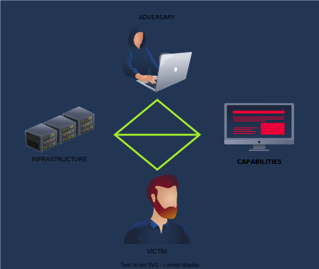

### Adversario

Dentro del lore del día logramos identificar al individuo que está causando los problemas. A este individuo lo llamaremos **adversary operator**.  
El adversary operator no es un atacante o entidad ofensiva ordinaria, son los responsables de ciberataques e intrusiones. Estos pueden ser individuos u organizaciones con el objetivo de interrumpir las operaciones de otro.

Hay más de un tipo de adversario. El **adversary customer** es otro personaje intrigante dentro de este entorno. Estos son los encargados de cosechar las recompensas obtenidas por el ataque satisfactorio y le permite a otros adversarios consolidarse.  
ChatGPT agrega una explicación para ayudar a que se comprenda mejor:

> En resumen, el término "adversario customer" dentro del modelo diamante se refiere a la consideración de los adversarios como "clientes" de las vulnerabilidades, buscando explotarlas con el objetivo de comprometer la seguridad de una organización o sistema.

Para concluir la explicación THM nos recomienda visualizar a estas entidades como un grupo de adversarios que trabajan en conjunto para orquestar una serie de brechas de seguridad.

### Víctima

El objetivo del adversario. Puede ser un individuo, un dominio o una organización.

### Infraestructura

Todo adversario necesita herramientas. Necesitan software o hardware que les permitan ejecutar sus objetivos maliciosos. La infraestructura representa todas las interconexiones físicas y lógicas que el adversario emplea. Un ejemplo podría ser el USB malicioso con el que trabajamos unos días atrás.

Es importante tener en cuenta que la infraestructura puede o no estar en manos del adversario. En algunos casos la infraestructura la provee un intermediario que recibe un resarcimiento económica.

### Capacidad

Refiere a las capacidades que tiene un adversario; qué habilidades, herramientas y técnicas emplea. Algunos ejemplos:

- **Phishing**: los adversarios pueden usar emails malintencionados que engañen a individuos para que estos revelen información confidencial o clickeen en links maliciosos.
- **Explotar vulnerabilidades**: los adversarios pueden abusar de vulnerabilidades o fallas en el software, sistemas o redes para obtener acceso y realizar distintas acciones malintencionadas. Un ejemplo de esto es la inyección SQL que vimos en el día 10.
- **Ingeniería social**: los adversarios pueden manipular a individuos mediante técnicas psicológicas para ganar acceso u obtener información confidencial.
- **Ataques de malware**: los adversarios pueden desplegar software malicioso, como virus, worms, ransomware, etc. para ganar control del sistema o robar información.
- **Amenaza interna**: los adversarios pueden tener individuos infiltrados en una organización que haga uso de sus privilegios para efectuar acciones malintencionadas como comprometer sistemas, robar información o interrumpir el flujo de operaciones.
- **Ataque denial-of-service (DoS)**: los adversarios pueden abrumar al sistema o a la red objetivo mediante tráfico o consultas excesivas. Esto tiene como consecuencia posible que el sistema quede congelado, crashee o simplemente se vea incapaz de realizar sus objetivos.

## Diamond model defensivo

Los componentes del modelo diamante que nos interesan para las tareas defensivas son: capability e infrastructure.

### Capacidad defensiva

Se dice que la defensa es la mejor ofensiva. Dentro las capacidades defensivas vamos a enfocarnos particularmente en dos:

- **Threat hunting**: consiste en un proceso proactivo e iterativo, al mando de profesionales del área de seguridad. Los profesionales buscan activamente pistas de la presencia de actividad maliciosa o vulnerabilidades. Las organizaciones pueden detectar adversarios en una etapa temprana de su ataque mediante *threat hunts* periódicas.
- **Vulnerability management**: es un proceso estructurado que consiste en identificar, evaluar, priorizar, mitigar y monitorizar vulnerabilidades dentro de un sistema/aplicación. Escaneos de vulnerabilidad periódicos ayudan a la identificación de debilidades que los adversarios podrían abusar. Priorizar vulnerabilidades en base a su impacto, actuar frente a las mismas y mantener un registro son tareas esenciales. El monitoreo continuo y una pen-testing periódica son cruciales para el endurecimiento de la seguridad.

### Infraestructura defensiva

Para fortificar nuestra infraestructura vamos a hacer uso de distintas capas de software y hardware. Con estas capas vamos a lograr que el adversario tenga más dificultades para realizar sus actividades malintencionadas.

Particularmente nos interesan dos componentes esenciales para la infraestructura defensiva: los firewalls y honeypots.

#### Firewall

El firewall es un guardian de redes. Este dispositivo se mantiene vigilante, monitoreando y controlando el flujo del tráfico de red. Con sus reglas de seguridad predeterminadas puede repeler un gran rango de amenazas, desde acceso no autorizado y tráfico malicioso hasta intentos por acceder a información sensible.

Los firewalls vienen en diversas formas, desde software y hardware hasta una combinación de ambos. Algunos tipos comunes pueden ser:

- **Stateless/packet-filtering**: este firewall provee la funcionalidad más directa, inspecciona y filtra paquetes de red individuales basándose en una serie de reglas que apuntan a un una dirección IP de fuente o destino, a un protocolo o a un puerto. No considera el contexto de las conexiones a la hora de tomar una decisión y bloquea de manera efectiva ataques DoS y escaneo de puertos.
- **Stateful inspection**: este firewall es más sofisticado. Se lo utiliza para rastrear el estado de las conexiones de red y usar esta información para tomar decisiones de filtrado. Ejemplo: un paquete que llega a la red forma parte de una conexión establecida, este firewall permitiría su paso. Sin embargo, en casos en los que el paquete no sea parte de una conexión establecida, el mismo sería bloqueado.
- **Proxy service**: este firewall protege la red filtrando mensajes en la *application layer*. Puede bloquear el acceso a sitios web o bloquear la transferencia de tipos de archivo específicos.
- **Web application firewall (WAF)**: este firewall está diseñado para proteger aplicaciones web. Bloquea ataques comunes como inyecciones SQL, cross-site-scripting y DoS.
- **Next-generation firewall**: este firewall combina las funcionalidades de los siguientes firewalls: stateless, stateful y proxy. Puede detectar intrusiones y prevenir el filtrado de contenido.

La parte práctica referida a la configuración y aplicación del firewall se verá en la sección de [Resolución](#configurando-el-firewall-para-bloquear-tráfico).

#### Honeypot

Funciona como una trampa para los atacantes, se comporta como una vulnerabilidad lista para que los adversarios intenten abusar. Viene en distintas formas: aplicaciones, servidores e incluso redes.  
Las honeypots fueron diseñadas para simular ser víctimas legítimas, sin embargo, en el fondo están monitoreadas activamente por el actor defensor.

Se pueden clasificar en dos tipos:

- **Low-interaction honeypots**: simulan sistemas simples como un servidor web o una bdd. Recolectan información acerca del comportamiento del atacante y detectan el uso de nuevas estrategias.
- **High-interaction honeypots**: emulan sistemas completos, como un sistema operativo o una red. Recolectan información detalladas del atacante; sus comportamientos, sus técnicas con respecto al abuso de vulnerabilidades y realizan un estudio completo del mismo.

Al igual que en el caso del firewall, la parte práctica estará en [Resolución](#configurando-el-honeypot).

## Resolución

### SSH

Desde nuestra AttackBox podemos conectarnos via SSH a la VM del ejercicio utilizando las credenciales que THM nos da.


### Configurando el firewall para bloquear tráfico

Por defecto la herramienta de firewall en Ubuntu es **uncomplicated firewall**. Por defecto está apagado, para ver su estado hay que ejecutar:

```bash
sudo ufw status
```

Vemos algo así:

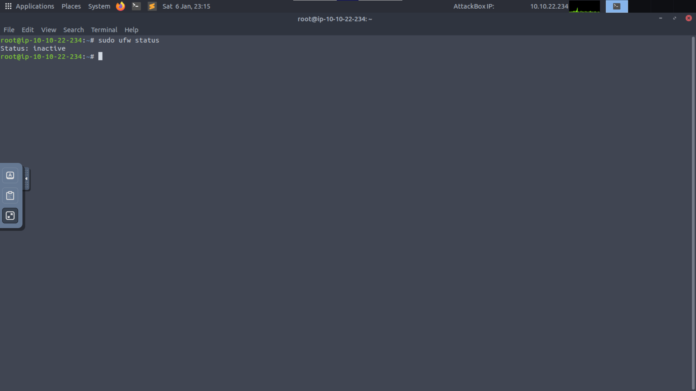

#### Agregando reglas

Todavía no tenemos ninguna regla para permitir o bloquear tráfico. Podemos aplicar la configuración por defecto, la cual consiste en denegar todas las conexiones que llegan y permitir las que salen.

```bash
sudo ufw default allow outgoing
sudo ufw default deny incoming
```

Y veríamos algo así:

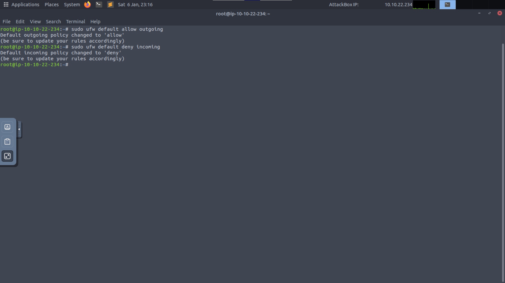

También podemos agregar, modificar o eliminar reglas especificando una dirección IP, un puerto, servicio o protocolo. En este caso vamos a agregar una regla que permite conexiones entrantes al puerto 22 (permite conexiones via SSH). El comando a utilizar es el siguiente:

```bash
sudo ufw  allow 22/tcp
```

El output:

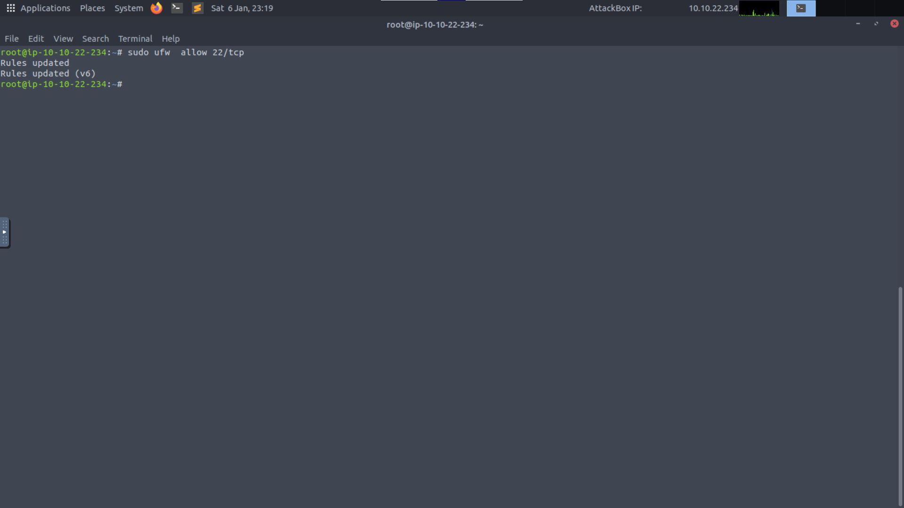

Algunos ejemplos de reglas mas complejas pueden ser: incorporar direcciones IP, subnets o interfaces de red. Algo así:

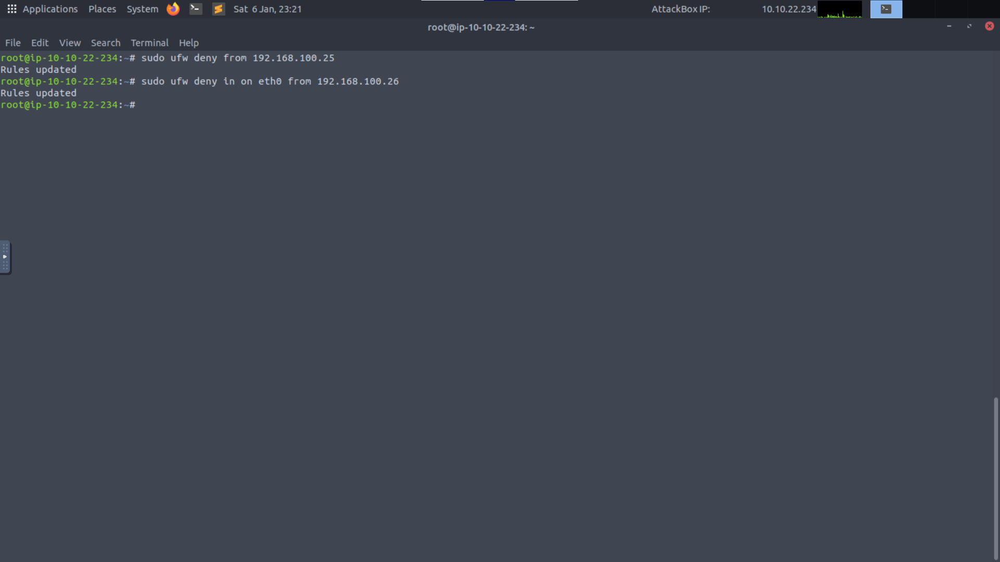

#### Activando el servicio

Ya tenemos las reglas necesarias, para activar el servicio hacemos lo siguiente:

```bash
sudo ufw enable
```

Y para chequear nuestras reglas:

```bash
sudo ufw status verbose
```

Output:

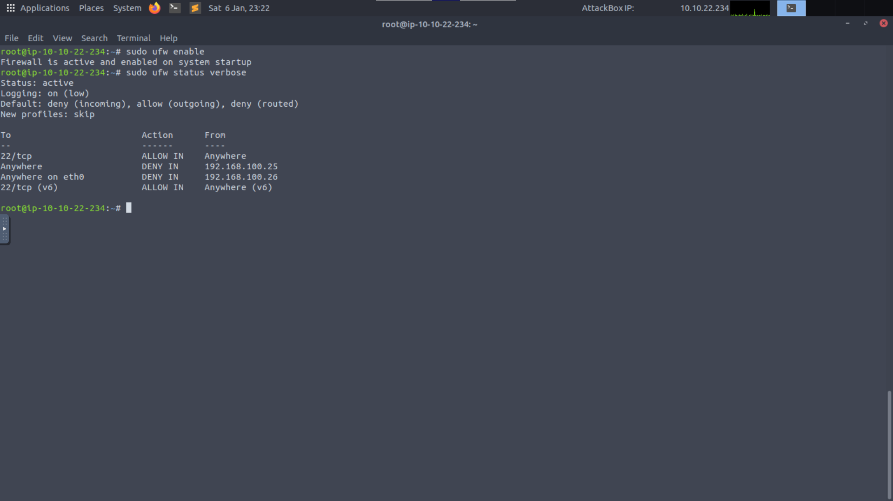

#### Reiniciando las reglas

En casos en los que hayamos agregado reglas incorrectas podemos reiniciar el firewall y revertir sus configuraciones.

```bash
sudo ufw reset
```

Veríamos algo así:

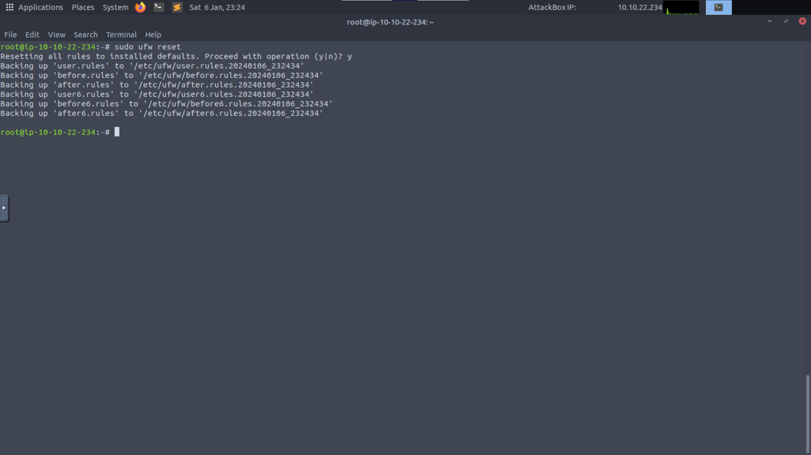

### Configurando el honeypot

Para demostrar como se levanta un honeypot vamos a hacer uso de una herramienta llamada **PenTBox**. La misma se encuentra en la AttackBox en `/home/vantwinkle/pentbox/pentbox-1.8`.

Al ejecutar la herramienta vemos algo así:

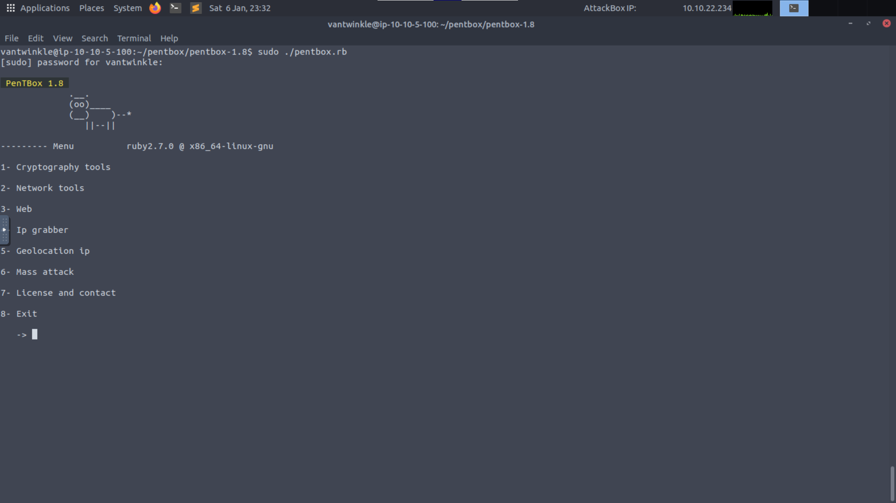

THM nos explica que nos interesan las opciones 2 y 3.

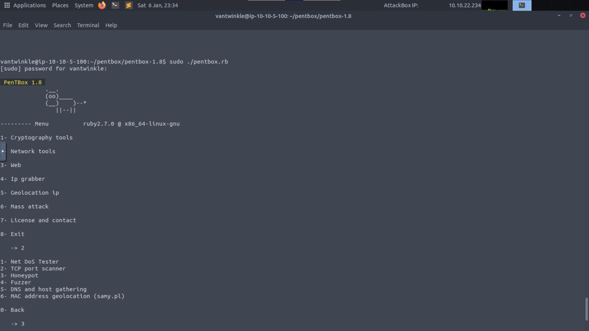

Por último nos presenta con dos opciones de configuración, una rápida y una manual. En la manual nos permite especificar distintas cosas como por ejemplo:

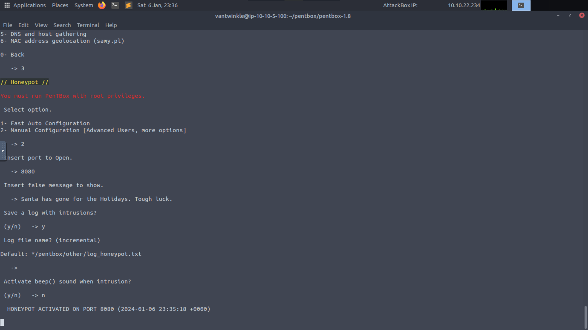

Podemos probarlo entrando desde el navegador de nuestra AttackBox a `MACHINE_IP:8080`. Veremos que en la consola nos sale:

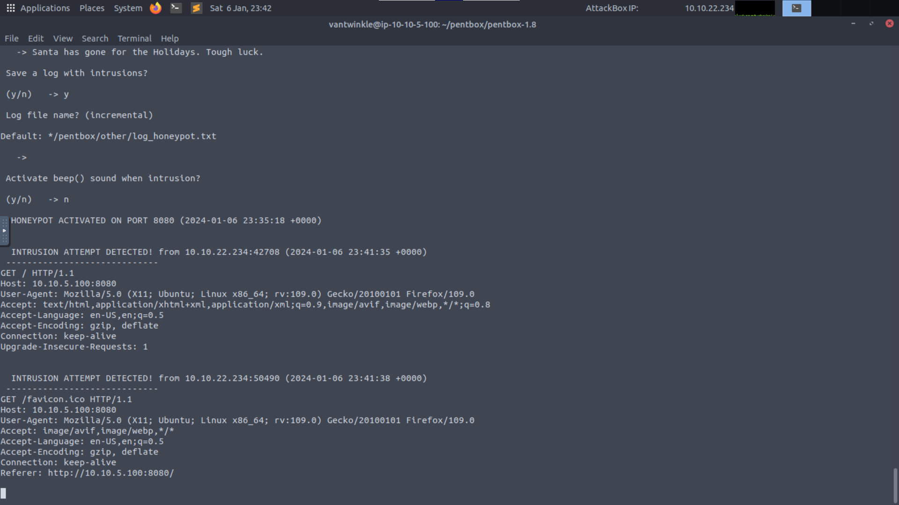

### Obteniendo la flag

La flag se encuentra en un sitio que está oculto mediante una serie de reglas de firewall. Las reglas se ejecutan con un script presente en `/home/vantwinkle/`.

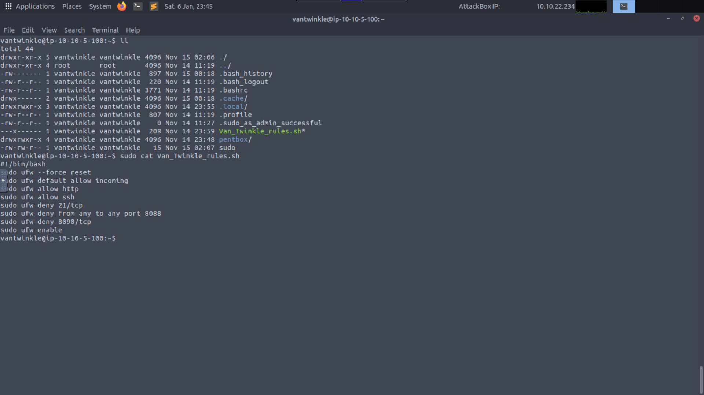

Nuestro trabajo es modificar esas reglas para poder acceder al sitio. Comencemos ejecutando el script:

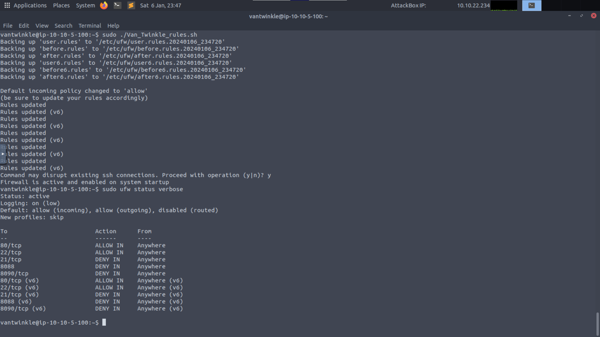

Algo a tener en cuenta es que, si bien en este caso obtuvimos información de los puertos mediante `cat` y el script. Podemos hacer lo mismo mediante la herramienta `nmap` de la siguiente manera:

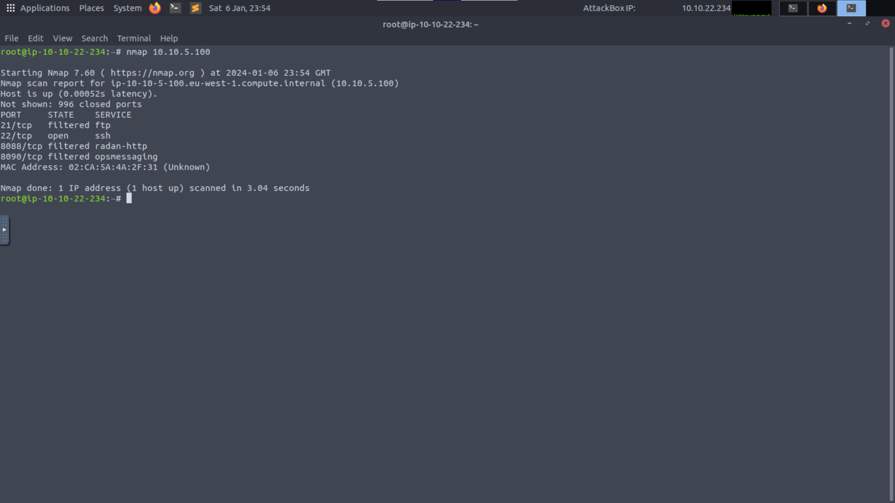

Volviendo a las reglas, tenemos un bloqueo a `8090/tcp`. Lo quitamos:

```bash
sudo ufw allow 8090/tcp
```

Probamos accediendo a `MACHINE_IP:8090` para ver la página secreta:

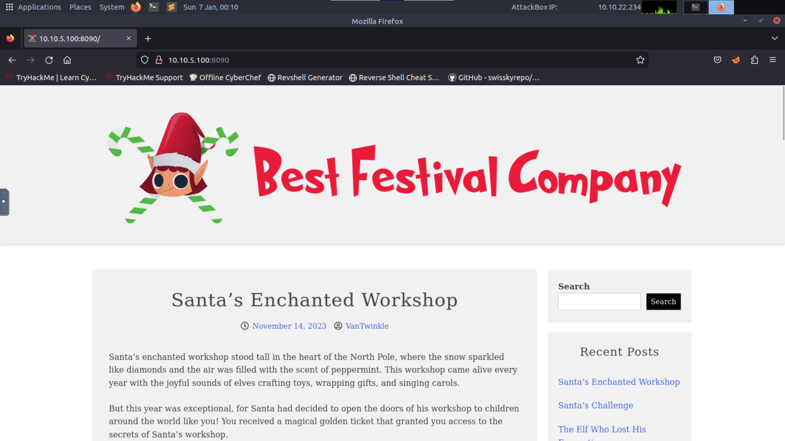

Y de acá sacamos la flag.

### Respuesta

<details>
<summary>Spoiler</summary>
<table>
  <thead>
    <tr>
      <th style="text-align:center">Información</th>
      <th style="text-align:center">Valor</th>
    </tr>
  </thead>
  <tbody>
    <tr>
      <td style="text-align:center">Modelo de seguridad utilizado para analizar las estrategias de breaching y defensa</td>
      <td style="text-align:center"><code>Diamond model</code></td>
    </tr>
    <tr>
      <td style="text-align:center">Defense capability utilizada para la búsqueda continua de signos de actividad maliciosa</td>
      <td style="text-align:center"><code>Threat hunting</code></td>
    </tr>
    <tr>
      <td style="text-align:center">Dos focos principales de nuestra infraestructura</td>
      <td style="text-align:center"><code>firewalls and honeypot</code></td>
    </tr>
    <tr>
      <td style="text-align:center">Comando del firewall para bloquear el tráfico</td>
      <td style="text-align:center"><code>deny</code></td>
    </tr>
    <tr>
      <td style="text-align:center">Flag presente en la página web oculta</td>
      <td style="text-align:center"><code>THM{P0T$_W@11S_4_S@N7@}</code></td>
    </tr>
  </tbody>
</table>
</details>

### [Volver a inicio](../../README.md)
