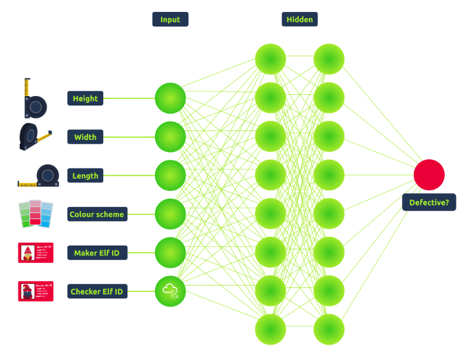
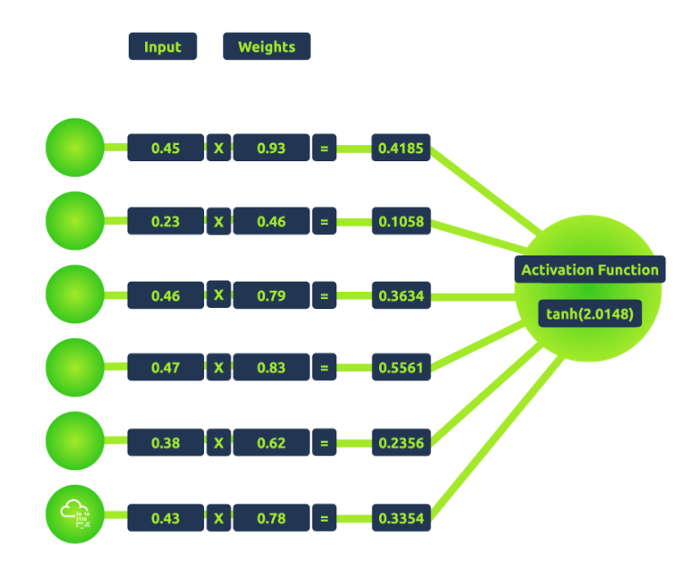
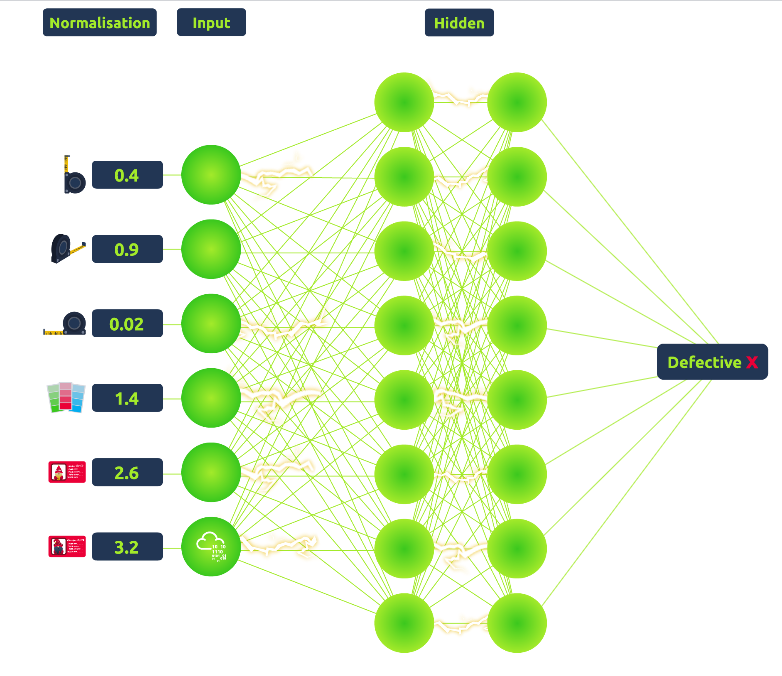
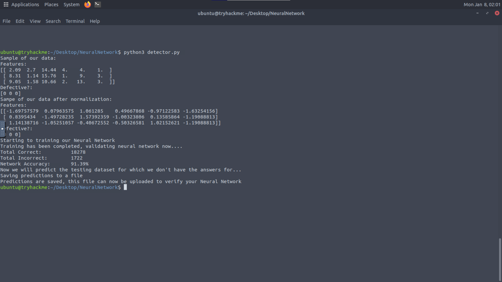
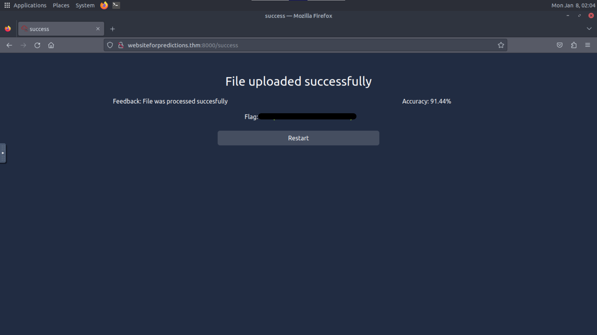

# Advent of Cyber Día 14: Machine learning

## Introducción

La historia del día trata sobre el ciclo de producción de los juguetes. Resulta que el CTO infectó a una serie de elfos en posiciones cruciales, logrando que estos produzcan juguetes defectuosos.  
Para contrarrestar esta medida, la elfa McSkidy tuvo la idea de incorporar "elfos de control" al ciclo de producción, estos elfos toman las medidas de los juguetes. Al comparar estas mediciones logran encontrar la posición del elfo problemático.  
Dado que esta tarea es bastante complicada, McSkidy quiere utilizar ML para optimizarla.

Entrando ya en los temas técnicos, en el día de hoy se trabajará con Python. Se verá una introducción teórica de varios temas sobre ML y se concluirá todo con la creación de nuestra propia red neuronal.

## Objetivos de aprendizaje

- Aprender sobre ML.
- Aprender las estructuras y algoritmos básicos de ML.
- Aprender a utilizar redes neuronales, en este caso para detectar juguetes defectuosos.

## Inteligencia artificial

La IA no puede definirse simplemente como un conjunto de `if`, por lo que para referirnos de manera mas concisa a lo que se va a ver hoy, vamos a traer el concepto de ML. Machine learning es un proceso que consiste en crear un sistema que simule el comportamiento presente en la realidad. Acá podemos volver al término IA; la inteligencia está presente en la vida real y sus estructuras, dado que nosotros estaríamos simulando este comportamiento en una computadora podríamos decir que estamos creando **artificialmente** un tipo de **inteligencia**.

Este campo de estudio es muy complejo y abarca una gran cantidad de conocimientos y técnicas, algunos de los ejemplos más populares son los siguientes:

- **Genetic algorithm**: esta estructura de ML tiene como objetivo simular el proceso de selección natural y evolución. Utiliza una serie de "rondas" (*rounds*) de descendencia y mutación basadas en las especificaciones provistas, su objetivo es crear al "descendiente más fuerte" mediante la "supervivencia del más apto".
- **Particle swarm**: esta estructura tiene como objetivo simular el comportamiento de las aves, más específicamente su agrupamiento en un punto específico. Al crear un **enjambre de partículas** la estructura logra desplazar a estas partículas al *optimal answer's grouping point*.
- **Neural networks**: es la estructura más popular, busca simular el comportamiento o la forma de trabajar de las neuronas en el cerebro. Una neurona recibe una serie de inputs, los mismos son transformados antes de enviarlos a la siguiente neurona. Estas neuronas pueden ser entrenadas para efectuar la mejor transformación con el objetivo de obtener una respuesta final correcta.

### Tipos de aprendizaje

Para entrenar a nuestra red neuronal primero tenemos que elegir cómo vamos a enseñarle. Hay varios estilos y subestilos, para este caso nos vamos a enfocar en estos dos:

- **Supervised learning**: en este estilo guiamos a la red neuronal a las respuestas correctas que queremos obtener. Le pedimos a la red neuronal que nos de una respuesta y le damos feedback sobre cuán cerca estuvo de la respuesta correcta. De esta manera estaríamos supervisando su evolución a medida que aprende. Es necesario tener en cuenta que para este estilo tenemos que tener un dataset del que sepamos la respuesta correcta. Este tipo de dataset se lo llama **labeled dataset**, ya que dado el input tenemos una especie de etiqueta que nos indica la respuesta correcta.
- **Unsupervised learning**: en este estilo la red neuronal tiene más autonomía, no nos entrometemos tanto en su aprendizaje. El objetivo de este estilo es que la red neuronal identifique "cosas interesantes". Los humanos son muy buenos en las tareas de identificación, por ejemplo: ver una imagen y averiguar de qué color es. Sin embargo si alguien pregunta "¿por qué es de ese color?", un humano no podría responder o tendría dificultades para hacerlo, esto se debe a que el ser humano puede ver cosas hasta la tercera dimensión, a diferencia de una red neuronal que tiene acceso a muchas dimensiones más, lo que le permite identificar muchos más patrones. Generalmente este estilo se aplica cuando se quiere clasificar o aprender sobre conceptos o temas que el ser humano no puede comprender o describir.

Para el problema que queremos resolver vamos a utilizar **supervised learning**.

### Estructura básica

Manteniéndonos en las bases de ML, una red neuronal consiste an un conjunto de nodos (neuronas) que se conectan de la siguiente manera:



De la imagen podemos distinguir tres capas:

- **Input layer**: es la primera capa, los nodos reciben un único input de información. Esta información luego se la pasan a la capa oculta. El número de nodos que esta capa envía, equivale a la cantidad de inputs (o *data parameters*) que recibe del input inicial. Por ejemplo: si nuestra red toma el largo, ancho y alto de un juguete, la input layer tendrá 3 nodos.
- **Output layer**: es la última capa de la red neuronal. Los nodos envían el output una vez que reciben el output de la hidden layer. EL número de nodos de esta capa corresponde al número de outputs de la red neuronal. Por ejemplo: si nuestra red devuelve si un juguete es defectuoso o no, tendríamos un único nodo como output (defectuoso o no defectuoso).
- **Hidden layer**: es la capa intermedia. En una red neuronal simple habría una única capa de este nodos de este tipo. Sin embargo, si quisiéramos darle más oportunidades de aprendizaje, podríamos agregar más capas y crear así una red más profunda. En esta capa es donde se produce el procesamiento principal. Cada nodo de esta capa recibe múltiples inputs y transmite su respuesta a múltiples nodos de la siguiente capa.

Si hacemos zoom en uno de los nodos de la hidden layer vemos lo siguiente:



Se simplifica un poco la parte matemática para un mejor entendimiento. Podemos decir que el nodo recibe inputs de los nodos de la capa previa, los suma y envía el output a la siguiente capa. Sin embargo, hay que tener en cuenta lo siguiente:

- **Suma**: no se suman directamente, sino que se multiplican primero por el valor de `weight`. Esto le permite a la red neuronal definir qué inputs contribuyen más al output.
- **Output final**: el output final no es el resultado directo de la operación que se comentó antes, sino que primero este valor pasa por la `Activation function`. Esta función en resumidas cuentas define si un nodo va a estar activo o no. Logra esto asegurándose de que, sin importar el input, el output siempre sea un valor decimal entre 0 y 1. (o entre -1 y 1).

### Etapa de entrenamiento

Hay dos etapas bien marcadas dentro del entrenamiento de una red neuronal:

1. **Feed-forward step**
2. **Back-propagation step**

### Feed-forward loop

Es la forma en la que le enviamos información a la red neuronal y obtenemos una respuesta del otro lado. Una vez entrenada la red neuronal, este es el único paso a ejecutar. En este punto detenemos el entrenamiento y lo único que nos interesa es obtener una respuesta.  
Para completar una ronda del *feed-forward step* hacemos lo siguiente:



1. **Normalizar todos los inputs**: para que la red sea capaz de definir qué inputs son relevantes para llegar a una respuesta final es necesario normalizarlos. Como se dijo previamente, cada nodo intenta mantener su respuesta entre 0 y 1. Si por el contrario tuviéramos un nodo que tenga un rango de 0-50 y otro con rango 0-2, la red no sería capaz de interpretarlo. Por lo que normalizamos todos para mantener un rango uniforme, en el caso del rango 0-50 podríamos dividir todos por 25 para pasarlos a un rango 0-2.
2. **Entregarle el input a la input layer**: luego de normalizar todo podemos proveerle el input a la primera capa de la red neuronal.
3. **Propagar la información por toda la red**: en cada nodo agregamos todos los inputs y los hacemos correr por la función de activación para obtener su output. Este output se convierte en el input de la siguiente capa. Repetimos este proceso hasta que lleguemos a la última capa de la red.
4. **Leer el output de la red**: una vez recibido el output de la output layer, tenemos una valor decimal entre 0 y 1, para tomar una decisión optamos por redondearlo para terminar así con una respuesta binaria.

### Back-propagation

Cuando estamos en la etapa de entrenamiento, el feed-forward loop es solo la mitad del proceso. Una vez recibida la respuesta de nuestra red debemos proveerle feedback sobre cuán cerca estuvo de la respuesta correcta. A esto se le conoce como *back-propagation step*, y consiste en lo siguiente:


1. **Calcular la diferencia entre el output recibido y el esperado**: la función de activación nos provee con una respuesta decimal entre 0 y 1. Podemos calcular la diferencia de este output y el valor que esperamos. Esta diferencia nos dice lo lejos o cerca que la red estuvo de llegar a la respuesta correcta.
2. **Actualizar las *weights* de los nodos**: con la diferencia calculada podemos ir actualizando las *weights* de cada input de la output layer. THM menciona que no se prestará mucha atención a esta parte ya que requiere el uso de matemática complicada.
3. **Propagar la diferencia a las capas anteriores**: de acá viene el término *back-propagation*. Luego de actualizar las *weights* en el paso previo, podemos calcular la diferencia para los nodos anteriores. Repetimos este proceso hasta completar la input layer.

Una vez terminada la etapa número 3, podemos correr nuevamente la red con otro input. Repetimos este proceso para ir así entrenando a la red.

### Dataset splits

Para explicar esto THM usa la siguiente analogía. Digamos que un profesor le dice constantemente a su alumno que `1 + 1 = 2` y `2 + 2 = 4`. Sin embargo, en el examen le pide calcular `3 + 3`. La pregunta sería: ¿aprendió el alumno la respuesta a esa pregunta? ¿o solamente aprendió el *principio fundamental* que le permite llegar a la misma?  
En resumen, se puede sobre-entrenar a una persona solamente con las respuestas, en lugar de aprender el principio fundamental. Lo mismo puede aplicarse a redes neuronales.

Sobre-entrenar es un problema relevante dentro de las redes neuronales. Entrenamos a estas redes con información de la que ya conocemos la respuesta, por lo que es posible que la red solamente aprenda las respuestas y no *cómo obtenerlas*. Para contrarrestar esto tenemos que validar que la red esté aprendiendo el proceso y no solamente la respuesta. Esto también nos permite darnos cuenta cuándo tenemos que detener el proceso de aprendizaje.  
Para efectuar esta validación separamos nuestro dataset en tres:

- **Training data**: es el dataset mas extenso. Lo utilizamos para entrenar a la red y, generalmente, abarca el 70-80% del dataset original.
- **Validation data**: lo utilizamos para validar el aprendizaje de la red. Luego de cada ronda de entrenamiento, enviamos este dataset por la red para determinar su actuación. Si esta actuación decae, es señal de que estamos sobre-entrenando a la red y deberíamos parar el proceso. Generalmente abarca el 10-15% del dataset original.
- **Testing data**: se utiliza para calcular la actuación final de la red. La red no verá esta información hasta que su proceso de aprendizaje concluya. Cuando la red ya está entrenada, le pasamos este dataset para determinar su performance. Generalmente abarca el 10-15% del dataset original.

## Resolución

### Armando la red neuronal

La VM nos provee con los siguientes archivos:

- `detector.py`: acá se arma la red neuronal.
- `dataset_train.csv`: training dataset. Acá esta presente tanto la medición de los juguetes como si son defectuoso o no. Este dataset se va a utilizar para entrenar, validar y probar la red neuronal.
- `dataset_test.csv`: testing dataset. Acá solamente está presente la medición de los juguetes. Una vez entrenada la red neuronal vamos a predecir qué juguetes de este archivo son defectuosos.

Terminemos de implementar `detector.py`. Actualmente, la primera parte del código contiene lo siguiente:

```python
#These are the imports that we need for our Neural Network
#Numpy is a powerful array and matrix library used to format our data
import numpy as np
#Pandas is a data processing library that also allows for reading and formatting data structures
import pandas as pd
#This will be used to split our data
from sklearn.model_selection import train_test_split
#This is used to normalize our data
from sklearn.preprocessing import StandardScaler
#This is used to encode our text data to integers
from sklearn.preprocessing import LabelEncoder
#This is our Multi-Layer Perceptron Neural Network
from sklearn.neural_network import MLPClassifier

#These are the colour labels that we will convert to int
colours = ['Red', 'Blue', 'Green', 'Yellow', 'Pink', 'Purple', 'Orange']


#Read the training and testing data files
training_data = pd.read_csv('training_dataset.csv')
training_data.head()

testing_data = pd.read_csv('testing_dataset.csv')
testing_data.head()

#The Neural Network cannot take Strings as input, therefore we will encode the strings as integers
encoder = LabelEncoder()
encoder.fit(training_data["Colour Scheme"])
training_data['Colour Scheme'] = encoder.transform(training_data['Colour Scheme'])
testing_data['Colour Scheme'] = encoder.transform(testing_data['Colour Scheme'])


#Read our training data from the CSV file.
#First we read the data we will train on
X = np.asanyarray(training_data[['Height','Width','Length','Colour Scheme','Maker Elf ID','Checker Elf ID']])
#Now we read the labels of our training data
y = np.asanyarray(training_data['Defective'].astype('int'))

#Read our testing data
test_X = np.asanyarray(testing_data[['Height','Width','Length','Colour Scheme','Maker Elf ID','Checker Elf ID']])
```

Clasifiquemos su funcionalidad:

1. Las primeras lineas realizan los imports necesarios. Necesitamos `pandas` para leer los datasets y `scikit-learn` para armar la red neuronal.
2. Luego cargamos los datasets. En nuestro caso tenemos datasets de entrenamiento y pruebas. Tenemos las labels para el dataset de entrenamiento, no para el de pruebas, por lo que podremos realizar **supervised learning**, pero solo conoceremos la verdadera performance de la red neuronal luego de subir nuestras predicciones.
3. Una vez cargada la información nos aseguramos que todos los inputs sean de valor numérico. Uno de nuestros datos corresponde al color del juguete, dado que la red solo puede recibir números, tenemos que encodear este valor a un número.
4. Por último cargamos todo lo restante. La variable `X` guarda nuestro training dataset junto con sus labels (en la variable `y`). La variable `test_X` guarda el testing dataset que utilizaremos para realizar las predicciones.

Luego de esta pantallazo inicial estamos listos para agregar el código faltante.

#### Creando los datasets

Buscamos en el código el comentario placeholder y agregamos lo siguiente:

```python
###### INSERT DATASET SPLIT CODE HERE ######
#Now we need to split our training dataset here
train_X, validate_X, train_y, validate_y = train_test_split(X, y, test_size=0.2)
```

Esto separará el dataset en cuestión en dos, `train_X` contiene la training data y `validate_X` nuestra validation data. Lo mismo sucede con `train_y` y `validate_y`, a diferencia que éstos contienen los labels.

#### Normalizando la información

Buscamos el comentario placeholder y agregamos:

```python
###### INSERT NORMALIZATION CODE HERE ######
#Now we normalize our dataset
scaler = StandardScaler()
scaler.fit(train_X)
train_X = scaler.transform(train_X)
validate_X = scaler.transform(validate_X)
test_X = scaler.transform(test_X)
```

En las primeras 2 líneas definimos `scaler` y luego lo utilizamos para normalizar nuestros 3 datasets (training, validation y testing).

#### Entrenando la red neuronal

Al igual que antes, buscamos el comentario y agregamos:

```python
##### INSERT CLASSIFIER CODE HERE ######
clf = MLPClassifier(solver='lbfgs', alpha=1e-5,hidden_layer_sizes=(15, 2), max_iter=10000)
```

Donde cada cosa corresponde a:

1. `solver=`: el algoritmo utilizado para actualizar las *weights*. El elegido es el clásico algoritmo back-propagation, sin embargo pueden utilizarse otros.
2. `alpha=`: valor utilizado para regularizar la red neuronal. No es relevante en este momento a dada su complejidad matemática, basta saber que el valor seleccionado es considerado el valor por defecto.
3. `hidden_layer_sizes=`: la estructura de las hidden layers de nuestra red. En nuestra configuración especificamos que queremos 2 capas con 15 nodos cada una.
4. `max_iter=`: cantidad de iteraciones máximas a realizar antes de que se detenga el entrenamiento.

Para efectuar el entrenamiento nos desplazamos al siguiente comentario y agregamos:

```python
###### INSERT CLASSIFIER TRAINING CODE HERE ######
clf.fit(train_X, train_y)
```

Al terminar la ejecución del código que agregamos tendremos la red neuronal entrenada.

#### Validando la red neuronal

El siguiente paso consiste en validar la red neuronal. Podemos pedirle que prediga valores basándose en nuestro validation dataset. Nuevamente, buscamos el comentario y agregamos el código:

```python
###### INSERT CLASSIFIER VALIDATION PREDICTION CODE HERE #######
y_predicted = clf.predict(validate_X)
```

Luego nos encontramos con una sección del código que se encarga de determinar el porcentaje de efectividad comparando las dos listas:

```python
#This function tests how well your Neural Network performs with the validation dataset
count_correct = 0
count_incorrect = 0
for x in range(len(y_predicted)):

    if (y_predicted[x] == validate_y[x]):
        count_correct += 1
    else:
        count_incorrect += 1

print ("Training has been completed, validating neural network now....")
print ("Total Correct:\t\t" + str(count_correct))
print ("Total Incorrect:\t" + str(count_incorrect))

accuracy =  ((count_correct * 1.0) / (1.0 * (count_correct + count_incorrect)))

print ("Network Accuracy:\t" + str(accuracy * 100) + "%")
```

#### Predicción final

Por último, tenemos que hacer que nuestra red neuronal haga predicciones sobre la testing data que no fué categorizada por los elfos. Para eso agregamos el siguiente código en el último comentario:

```python
###### INSERT CLASSIFIER TESTING PREDICTION CODE HERE ######
y_test_predictions = clf.predict(test_X)
```

### Porcentaje de efectividad

Ejecutamos el script y obtenemos lo siguiente:



Vemos que pasamos el 90%, por lo que siguiendo las instrucciones de THM, procedemos a subir el archivo que obtuvimos de como output a [website for predictions](http://websiteforpredictions.thm:8000/).



### Respuesta

<details>
<summary>Spoiler</summary>
<table>
  <thead>
    <tr>
      <th style="text-align:center">Información</th>
      <th style="text-align:center">Valor</th>
    </tr>
  </thead>
  <tbody>
    <tr>
      <td style="text-align:center">Término que corresponde al subset de IA que le enseña a las computadoras cómo piensan los humanos</td>
      <td style="text-align:center"><code>Machine learning</code></td>
    </tr>
    <tr>
      <td style="text-align:center">Estructura de ML que simula el proceso de selección natural y evolución</td>
      <td style="text-align:center"><code>Genetic algorithm</code></td>
    </tr>
    <tr>
      <td style="text-align:center">Estilo de aprendizaje que utiliza información categorizada para entrenar una estructura de ML</td>
      <td style="text-align:center"><code>Supervised learning</code></td>
    </tr>
    <tr>
      <td style="text-align:center">Capa que se encuentra entre las capas de input y output en una red neuronal</td>
      <td style="text-align:center"><code>Hidden layer</code></td>
    </tr>
    <tr>
      <td style="text-align:center">Proceso utilizado para darle feedback a la red neuronal</td>
      <td style="text-align:center"><code>Back-propagation</code></td>
    </tr>
    <tr>
      <td style="text-align:center">Flag obtenida luego de llegar a un porcentaje de acierto del 90%</td>
      <td style="text-align:center"><code>THM{Neural.Networks.are.Neat!}</code></td>
    </tr>
  </tbody>
</table>
</details>

### [Volver a inicio](../../README.md)
