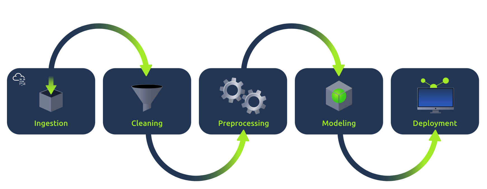
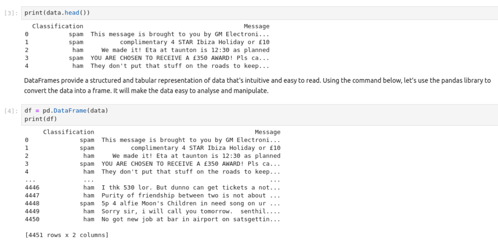
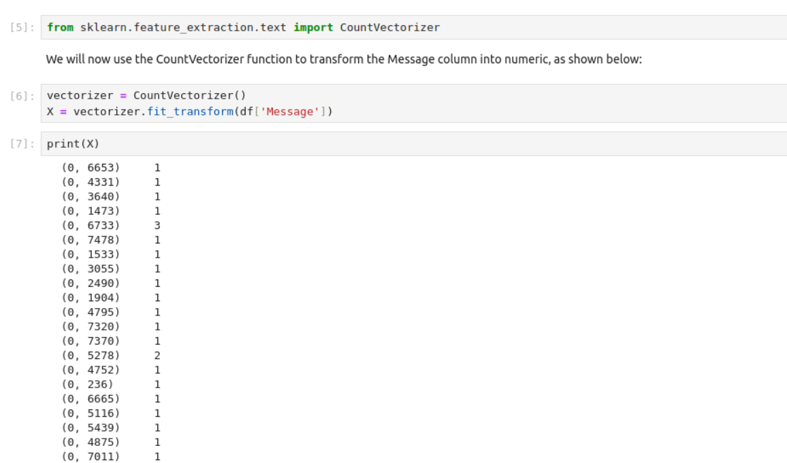
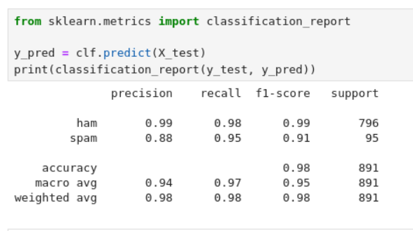
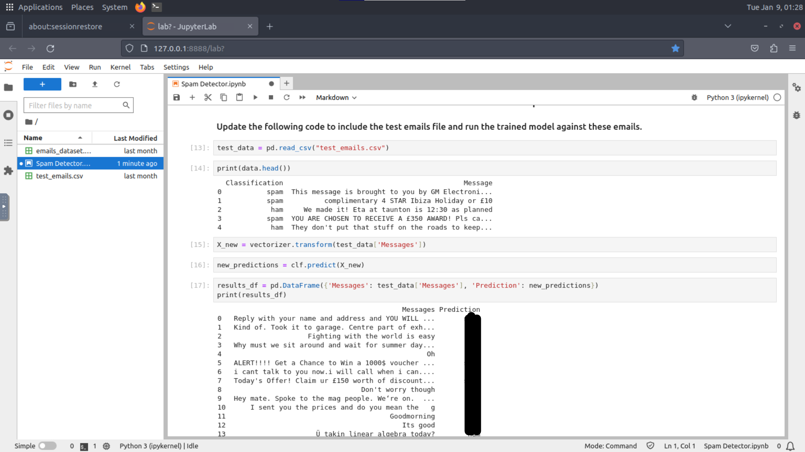

# Advent of Cyber Día 15: Machine learning

## Introducción

La historia del día trata sobre un problema que tienen los protagonistas con respecto a unos emails. Últimamente están recibiendo mucho spam en su bandeja de correo, lo que quiere decir que el detector de este tipo de mails fraudulentos está fallando o fué desactivado/dañado a propósito.

Se trabajará nuevamente sobre ML, haremos uso de Python y Jupyter Notebooks para armar un nuevo sistema de detección de spam.  

## Objetivos de aprendizaje

- Aprender sobre los diferentes pasos dentro de un pipeline genérico de ML.
- Aprender sobre clasificación y entrenamiento de diversos modelos de ML.
- Aprender a separar el dataset en training y testing data.
- Aprender a preparar un modelo de ML.
- Aprender a evaluar la efectividad de un modelo.

## ML pipeline

La machine learning pipeline refiere a la serie de pasos involucrados en el armado y deploy de un modelo ML. Típicamente el pipeline incluye la recolección de datos de diferentes fuentes en diferentes formas, el preprocesamiento, la separación de los datasets, el entrenamiento y por último la aplicación del modelo y sus predicciones.

Visualmente se vería algo así:



### Paso 0: importar lo necesario

Antes de comenzar con la recolección de datos es necesario importar las herramientas que vamos a necesitar.

```python
import numpy as np
import pandas as pd
```

### Paso 1: recolectar información

Este paso consiste en la recolección de la información (en formato "crudo") de diversas fuentes. Esta información puede venir de bdd, archivos de texto, APIs, repositorios, sensores, web scraping, etc.

Para leer la información vamos a hacer uso de una función dentro de `pandas`, la biblioteca que importamos en el paso previo.

```python
data = pd.read_csv("emails_dataset.csv")
```

Veamos cómo se ve la información:



En la imagen vemos también la información en formato `DataFrame`. Este formato es mucho más cómodo ya que, como indica la explicación, nos permite visualizar todo en un formato estructurado.

### Paso 2: pre-procesar la información

Consiste en transformar la *raw data* en información limpia, organizada y entendible para el modelo. Dado que generalmente la información llega desprolija, desordenada e incompleta, hay varios técnicas distintas para el pre-procesamiento.

#### Uso de `CountVectorizer`

Dado que los modelos de ML solo entienden números, no texto. Es necesario transformar el texto a un formato numérico. Esto lo logramos con `CountVectorizer`, una función de la biblioteca `scikit-learn` de Python.



### Paso 3: separar dataset en train/test

Es importante probar la efectividad del modelo frente a valores que no ha visto previamente. Para lograr esto podemos separar nuestra información en dos, entrenar el modelo con un subset y luego probarlo con el otro.

Para realizar la separación vamos a hacer uso de la biblioteca `scikit-learn`, de la siguiente manera:

```python
from sklearn.model_selection import train_test_split
y = df['Classification']
X_train, X_test, y_train, y_test = train_test_split(X, y, test_size=0.2)
```

Donde cada elemento de la función corresponde a:

- `X`: primer argumento de la función `train_test_split`, es la matriz que obtuvimos de `CountVectorizer`. Contiene los tokens que representan el texto luego de su transformación.
- `y`: segundo argumento, consiste en los labels para cada instancia del dataset. En este caso el label indica si un mensaje es spam o no.
- `test_size=0.2`: este argumento especifica que el 20% del dataset original será el subset de test, mientras que el 80% restante será utilizado para el entrenamiento.

Y devuelve lo siguiente:

- `X_train`: subset correspondiente a las *features* utilizadas para el entrenamiento.
- `X_test`: subset correspondiente a las *features* utilizadas para el testing.
- `y_train`: labels correspondientes al set `X_train`.
- `y_test`: labels correspondientes la set `X_test`.

### Paso 4: entrenar el modelo

Ahora tenemos que elegir un modelo de clasificación de texto y utilizarlo para entrenar el dataset. Hay varios métodos, en este caso vamos a utilizar el llamado **Naive Bayes Classifier**.

#### Naive Bayes Classification

Digamos que tenemos un conjunto de emails, algunos con label *spam* y otros con label *ham*. Este algoritmo aprende de estos emails, analiza las palabras en cada email y calcula cuán frecuentemente cada palabra aparece en los emails spam y ham. Luego calcula la probabilidad de si un email es spam basándose en las palabras que contiene.  
Un ejemplo concreto sería cuando llega un email que diga "Win a free toy now!":

- La palabra "Win" aparece generalmente en los emails spam, lo que hace que aumente la probabilidad de que se trate de uno de ellos.
- "free" también aparece, lo que aumenta aún más la probabilidad.
- "toy" es una palabra neutral, aparece tanto en emails spam como ham.
- Luego de evaluar todas las palabras calcula la probabilidad en base al análisis explicado previamente. En resumen, si contiene más palabras de spam es spam, caso contrario es ham.

Para comenzar el entrenamiento con este método hacemos lo siguiente:

```python
from sklearn.naive_bayes import MultinomialNB
clf = MultinomialNB()
clf.fit(X_train, y_train)
```

Donde el primer parámetro corresponde a la training data de la cual queremos que aprenda nuestro modelo. El segundo parámetro corresponde a los labels del set que pasamos como parámetro 1.

***TLDR***: el método `fit` es el que comienza el entrenamiento del modelo basándose en el set y label que recibe como parámetros.

### Paso 5: evaluar el modelo

Luego del entrenamiento tenemos que evaluar sus capacidades predictivas. Podemos utilizar lo siguiente para visualizar las métricas:

```python
from sklearn.metrics import classification_report
y_pred = clf.predict(X_test)
print(classification_report(y_test, y_pred))
```

Y veríamos algo así:



Donde cada elemento dentro de esta clasificación corresponde a:

- **Precision**: de todos los samples predichos como positivo, ¿cuántos lo fueron realmente?
- **Recall**: de todos los positivos, ¿cuántos fueron predichos correctamente?
- **F1-score**: mide los casos clasificados incorrectamente
- **Support**: cantidad de ocurrencias en el dataset utilizado
- **Accuracy**: ratio de predicciones correctas
- **Macro avg**: promedio *unweighted mean per label*
- **Weighted avg**: promedio *supported-weighted mean per label*

### Paso 6: probar el modelo

Si estamos satisfechos con la performance del modelo podemos proceder a la clasificación de nuevos emails. Hacemos lo siguiente:

```python
message = vectorizer.transform(["Today's Offer! Claim ur £150 worth of discount vouchers! Text YES to 85023 now! SavaMob, member offers mobile! T Cs 08717898035. £3.00 Sub. 16 . Unsub reply X "])
prediction = clf.predict(message) 
print("The email is :", prediction[0]) 
```

## Resolución

### Usando el modelo

Ya con el modelo listo podemos utilizarlo con el archivo `test_emails.csv` que nos provee THM.



Por último revisamos los emails categorizados como spam para obtener el código secreto.

### Respuesta

<details>
<summary>Spoiler</summary>
<table>
  <thead>
    <tr>
      <th style="text-align:center">Información</th>
      <th style="text-align:center">Valor</th>
    </tr>
  </thead>
  <tbody>
    <tr>
      <td style="text-align:center">Primer paso en el pipeline de ML</td>
      <td style="text-align:center"><code>Data Collection</code></td>
    </tr>
    <tr>
      <td style="text-align:center">Funcionalidad de preprocesamiento que crea/modifica nuevas funcionalidades para mejorar la performance</td>
      <td style="text-align:center"><code>Feature Engineering</code></td>
    </tr>
    <tr>
      <td style="text-align:center">Separando el 20% del dataset para testing. Porcentaje weightage avg de la precisión respecto a la detección de spam</td>
      <td style="text-align:center"><code>0.98</code></td>
    </tr>
    <tr>
      <td style="text-align:center">Cantidad de test emails marcados como spam</td>
      <td style="text-align:center"><code>3</code></td>
    </tr>
    <tr>
      <td style="text-align:center">Código secreto presente en uno de los emails detectados como spam</td>
      <td style="text-align:center"><code>I_HaTe_BesT_FestiVal</code></td>
    </tr>
  </tbody>
</table>
</details>

### [Volver a inicio](../../README.md)
