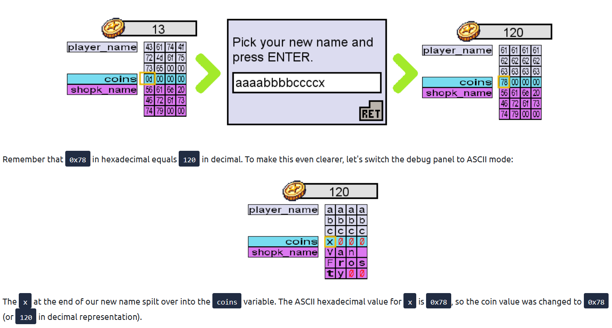
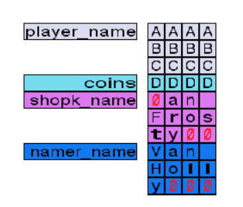
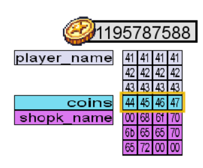
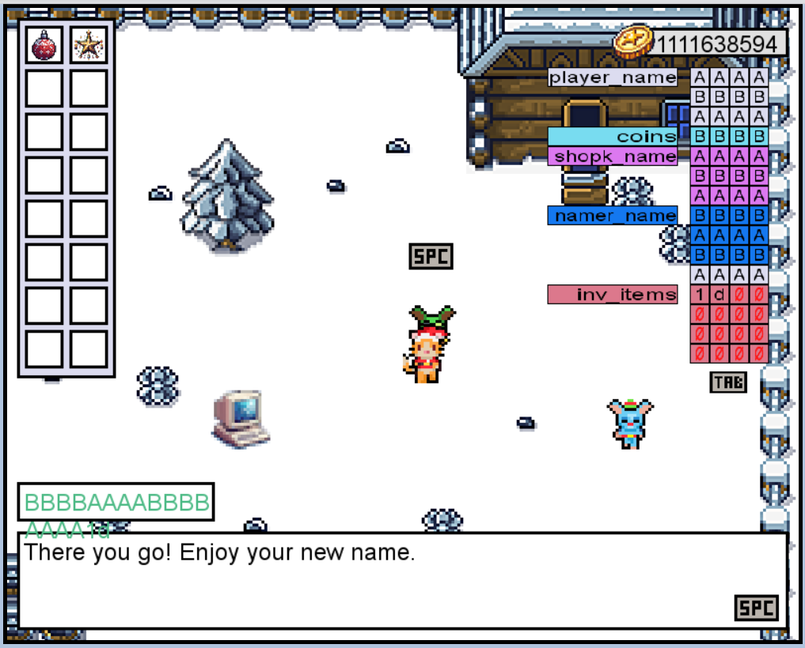

# Advent of Cyber Día 6: Corrupción de memoria

## Introducción

La historia del día de hoy trata sobre una sesión de entrenamiento sobre vulnerabilidad por corrupción de memoria. Se va a trabajar con una VM y un juego, nos cuentan que al jugar y seguir una serie de pasos como cambiar nombres a unos valores específicos, el juego comienza a comportarse raro (cambian los nombres de las cosas, se obtienen más o menos monedas, etc). El juego también cuenta con una ventana de debug, la cual usaremos para analizar el comportamiento de la memoria a medida que cambiamos los valores.

## Objetivos de aprendizaje

- Aprender sobre el manejo inseguro de memoria en algunos lenguajes.
- Entender por qué unas variables pueden "pisar" valores de otras que se encuentren contiguas en memoria.
- Aprender a aplicar un simple *buffer overflow* para cambiar valores en memoria a los que no se supone que podamos acceder.

## El juego

El juego trata muy resumidamente de un personaje que trabaja en una computadora y va consiguiendo dinero, con este dinero puede comprar distintos objetos navideños y además hablar con un NPC para cambiar su nombre.

### El bug

El problema llega cuando realizamos lo siguiente:

1. Hacer que el personaje trabaje hasta obtener 13 monedas.
2. Pedirle al NPC que cambie el nombre del personaje por "scroogerocks!".
3. Ver que ahora mágicamente tenemos 33 monedas.

La explicación de por qué se da esto es simple, cuando cambiamos el nombre del personaje por uno con una longitud superior a la esperada por el juego, éste se corrompe. A continuación se verá más en detalle.

## Corrupción de memoria

En este apartado nos cuentan más o menos como funciona la memoria, que cada elemento del juego está presente en la RAM y que, en un juego bien programado, cada modificación de estos elementos se da por acciones ya planeadas por los desarrolladores.

Luego hablan sobre casos en los que el juego no está bien programado, que esto nos permite cambiar indirectamente contenido de la memoria.

Por último hace un análisis del caso concreto del que se habló en el apartado previo y, haciendo uso del debugger presente en el juego, obtiene la siguiente información:

También nos habla de que esto ocurre generalmente en lenguajes como C/C++, ya que estos no tienen límites estrictos para las variables y, en caso de que los programadores no hagan el chequeo de los límites, ocurren estas cosas.

## Strings

En este apartado nos explican como funcionan muy por encima las strings, muestran que en memoria terminan con el caracter nulo `0x00`.

Además nos muestra que si le damos al nombre una string de un tamaño muy concreto para este caso, podemos hacer que el caracter nulo pise otra variable. En el ejemplo nos muestran como pisamos la variable que tiene el nombre del NPC y borramos su nombre del juego.

## La variable Coins y el tipo INT en C++

Acá nos muestran que si ponemos el valor `AAAABBBBCCCCDEFG` como nombre obtenemos `1195787588` monedas. La ventana de debug se ve así:

Al hacer la conversión del valor hex vemos que da otro resultado:

Nos explican que esto se da ya que los enteros de C++ se guardan de una manera un poco particular en memoria.

- Ocupan 4 bytes.
- Los bytes se guardan al revés (*little-endian order*).

Para entender mejor el hecho de que se guarden al revés los bytes, analicemos: tenemos las `1195787588` monedas y obtenemos el valor hex `0x[47 46 45 44]`, si revisamos el valor hex puesto en la imagen anterior vemos que son los mismos bytes pero comenzando desde el final, es decir, con orden invertido.

## Resolución

### Monedas

Primero nos piden obtener el valor de las monedas sabiendo que en la ventana debug se ve el hex `4f4f5053`. Para resolver esto basta con usar la herramienta de conversión con el valor hex pero invertido, es decir con `53504f4f`.

### Ganar el juego

Por último nos pide una flag que obtendremos al ganar el juego, para esto tenemos que conseguir el adorno navideño gastando 1000 monedas. Sin embargo, cuando queremos comprarlo, el NPC se da cuenta que hicimos trampa.

Para poder obtenerlo tenemos que corromper la memoria como hicimos con las monedas, pero con un valor que llegue hasta pisar el valor de los items de inventario, el adorno tiene un id `d` en la tienda, por lo que tendríamos que de alguna manera hacer que ese id llegue a la memoria.

Analizando la ventana de debug vemos que la variable `inv_items` es la que tiene nuestras cosas, la misma se encuentra al final de la lista, por lo que tendríamos que pisar todas las otras variables previas. Ingresando un nombre lo suficientemente largo y que al llegar al inventario contenga la `d` que necesitamos, podremos ganar.

### Respuesta

| Información                      | Valor                             |
| :------------------------------- | :-------------------------------- |
| Valor de monedas para `4f4f5053` | 1397772111                        |
| Flag                             | THM{mchoneybell_is_the_real_star} |

### [Volver a inicio](../../README.md)
