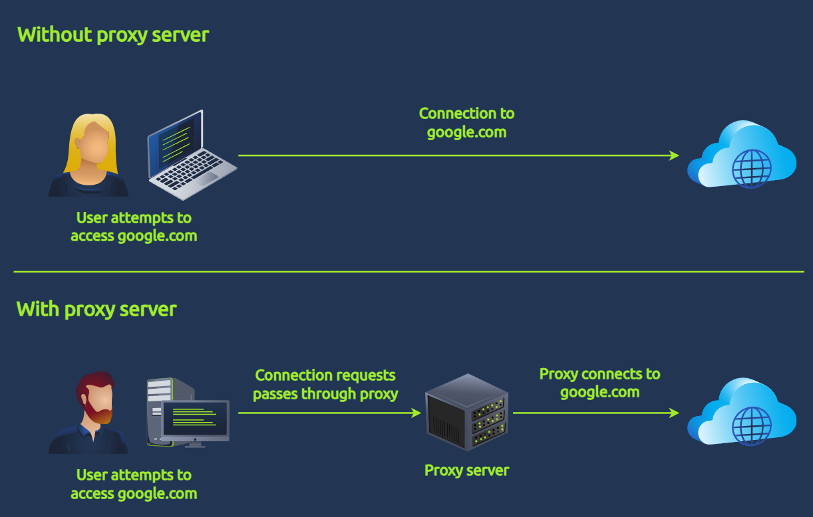

# Advent of Cyber Día 7: Log analysis

## Introducción

La historia del día de hoy trata sobre un crypto miner que fué plantado por el villano en las PC y servidores de los protagonistas, además de como su nombre indica, minar criptomonedas, también roba información.

En el día de hoy se va a trabajar principalmente con la terminal de la VM y con mucha manipulación de texto, se va a hacer uso de distintos comandos de Linux para ir filtrando la información del archivo de log.

## Objetivos de aprendizaje

- Repaso de logs y su importancia.
- Aprender sobre los proxy y cómo se compone su log.
- Aprender a parsear texto desde la terminal de Linux.
- Aprender sobre análisis de logs basándose en casos típicos.

## Servidor proxy

Un proxy es un intermediario entre el dispositivo e internet. Cuando se pide información o se accede a una web, en vez de conectarse directamente a la página web, se conecta al proxy, y luego éste se conecta a la página web.



Un servidor proxy permite un mayor control y visibilidad del tráfico de red, le permite a los administradores poder ver qué sitios se visitan y, en caso de ser necesario, bloquear el acceso a sitios particulares.

A continuación se ven algunos ejemplos de actividades maliciosas que pueden encontrarse en un log se un servidor proxy:

| Ataque                                      | Indicador potencial                                                                                    |
| :------------------------------------------ | :----------------------------------------------------------------------------------------------------- |
| Intento de descarga de un binario malicioso | Conexión a una URL maliciosa conocida. Ej: www[.]evil[.]com/malicious[.]exe                            |
| Fuga de información                         | Alto contenido de banda ancha debido a la carga de archivos. Ej: conexión saliente a OneDrive.         |
| Conexión C2 continua                        | Alto contenido de conexiones salientes a un dominio particular. Ej: conexión a sitio X cada 5 minutos. |

## Comandos de Linux útiles para esta tarea

### `cat`

Sirve para con**cat**enar varios archivos y mostrar su contenido, en caso de que se lo ejecute con un archivo solo, muestra su contenido.

```bash
ubuntu@tryhackme:~/Desktop/artefacts$ cat access.log
[2023/10/25:15:42:02] 10.10.120.75 sway.com:443 CONNECT - 200 0 "-"
[2023/10/25:15:42:02] 10.10.120.75 sway.com:443 GET / 301 492 "Mozilla/5.0 (Windows NT 10.0; Win64; x64) AppleWebKit/537.36 (KHTML, like Gecko) Chrome/118.0.0.0 Safari/537.36"
--- REDACTED FOR BREVITY ---
```

### `less`

Sirve para ver los contenidos de un archivo pero de a trozos, ya que `cat` muestra todo el contenido de una.

```bash
ubuntu@tryhackme:~/Desktop/artefacts$ less access.log
```

Se utilizan las flechas para desplazarse por las páginas y `q` para salir.

### `head`

Muestra los contenidos que se encuentran al tope del archivo. Se puede especificar la cantidad de líneas con `-n`.

```bash
ubuntu@tryhackme:~/Desktop/artefacts$ head -n 1 access.log
[2023/10/25:15:42:02] 10.10.120.75 sway.com:443 CONNECT - 200 0 "-"
```

### `tail`

A diferencia de `head` muestra los contenidos que se encuentran al final. También se puede usar `-n`.

```bash
ubuntu@tryhackme:~/Desktop/artefacts$ tail -n 1 access.log
[2023/10/25:16:17:14] 10.10.140.96 storage.live.com:443 GET / 400 630 "Mozilla/5.0 (Windows NT 10.0; Win64; x64) AppleWebKit/537.36 (KHTML, like Gecko) Chrome/118.0.0.0 Safari/537.36"
```

### `wc`

De **w**ord **c**ount, cuenta la cantidad de líneas, palabras y caracteres dentro del archivo. En este caso nos interesan las líneas, por lo que se va a usar la opción `-l`.

```bash
ubuntu@tryhackme:~/Desktop/artefacts$ wc -l access.log
49081 access.log
```

### `nl`

De **n**umber **l**ines, muestra los contenidos del archivo pero con numeración de líneas.

```bash
ubuntu@tryhackme:~/Desktop/artefacts$ nl access.log
     1  [2023/10/25:15:42:02] 10.10.120.75 sway.com:443 CONNECT - 200 0 "-"
     2  [2023/10/25:15:42:02] 10.10.120.75 sway.com:443 GET / 301 492 "Mozilla/5.0 (Windows NT 10.0; Win64; x64) AppleWebKit/537.36 (KHTML, like Gecko) Chrome/118.0.0.0 Safari/537.36"
     3  [2023/10/25:15:42:02] 10.10.120.75 sway.office.com:443 CONNECT - 200 0 "-"
--- REDACTED FOR BREVITY ---
```

### `cut`

Permite cortar las líneas en columnas dado un separador, similar al `split` en varios lenguajes de programación. También tiene la opción `-f` para indicar cuántas columnas se quiere visualizar.

```bash
ubuntu@tryhackme:~/Desktop/artefacts$ cut -d ' ' -f1,3,6 access.log
[2023/10/25:15:42:02] sway.com:443 200
[2023/10/25:15:42:02] sway.com:443 301
[2023/10/25:15:42:02] sway.office.com:443 200
--- REDACTED FOR BREVITY ---
```

En este caso estamos viendo tres columnas por línea: la 1, la 3 y la 6.

### `grep`

Es un comando que permite buscar texto en distintos archivos del sistema. La sintaxis es:

```bash
grep OPCIONES STRING_BUSCADA NOMBRE_ARCHIVO
```

Un ejemplo:

```bash
ubuntu@tryhackme:~/Desktop/artefacts$ grep 10.10.140.96 access.log
[2023/10/25:15:46:20] 10.10.140.96 flow.microsoft.com:443 CONNECT - 200 0 "-"
--- REDACTED FOR BREVITY ---
```

### `sort`

Ordena las líneas de un archivo de manera ascendente o descendente. Por defecto lo ordena alfabéticamente, sin embargo si usamos la opción `-n` se ordena numéricamente. Un ejemplo:

```bash
ubuntu@tryhackme:~/Desktop/artefacts$ cut -d ' ' -f3 access.log | cut -d ':' -f1 | sort
account.activedirectory.windowsazure.com
account.activedirectory.windowsazure.com
account.activedirectory.windowsazure.com
--- REDACTED FOR BREVITY ---
```

### `uniq`

Elimina los elementos duplicados. **Importante**: siempre es necesario hacer un `sort` primero (o que ya esté ordenado). Un ejemplo:

```bash
ubuntu@tryhackme:~/Desktop/artefacts$ cut -d ' ' -f3 access.log | cut -d ':' -f1 | sort | uniq
account.activedirectory.windowsazure.com
activity.windows.com
admin.microsoft.com
--- REDACTED FOR BREVITY ---
```

Mediante la opción `-c` se puede visualizar la cantidad de ocurrencias de cada elemento.

```bash
ubuntu@tryhackme:~/Desktop/artefacts$ cut -d ' ' -f3 access.log | cut -d ':' -f1 | sort | uniq -c
    423 account.activedirectory.windowsazure.com
    184 activity.windows.com
    680 admin.microsoft.com
    272 admin.overdrive.com
    304 adminwebservice.microsoftonline.com
```

## Formato del log

Los logs del servidor proxy tienen el siguiente formato:

```bash
timestamp - source_ip - domain:port - http_method - http_uri - status_code - response_size - user_agent
```

Un ejemplo:

```bash
[2023/10/25:16:17:14] 10.10.140.96 storage.live.com:443 GET / 400 630 "Mozilla/5.0 (Windows NT 10.0; Win64; x64) AppleWebKit/537.36 (KHTML, like Gecko) Chrome/118.0.0.0 Safari/537.36"
```

Donde cada elemento corresponde a:

| Posición | Campo                  | Valor                             |
| :------- | :--------------------- | :-------------------------------- |
| 1        | Timestamp              | `[2023/10/25:16:17:14]`           |
| 2        | IP de la fuente        | `10.10.140.96`                    |
| 3        | Dominio y puerto       | `storage.live.com:443`            |
| 4        | Método HTTP            | `GET`                             |
| 5        | URI HTTP               | `/`                               |
| 6        | Código de estado       | `400`                             |
| 7        | Tamaño de la respuesta | `630`                             |
| 8        | User agent             | `"Mozilla/5.0 (Windows NT 10..."` |

Haciendo uso del comando `cut` se puede extraer un campo específico, usaríamos `-d " "` para definir el separador y `-f1`, `-f2`, etc para elegir el campo.

## Linux pipes

En Linux se puede "conectar" dos o más comandos mediante el operador `|`. Su funcionamiento es enviarle el output del primer comando al segundo, el segundo al tercero y así.

### Obtener las primeras 5 conexiones hechas por 10.10.140.96

Usamos `grep` y `head` para limitar el número de resultados:

```bash
ubuntu@tryhackme:~/Desktop/artefacts$ grep 10.10.140.96 access.log | head -n 5
[2023/10/25:15:46:20] 10.10.140.96 flow.microsoft.com:443 CONNECT - 200 0 "-"
[2023/10/25:15:46:20] 10.10.140.96 flow.microsoft.com:443 GET / 307 488 "Mozilla/5.0 (Windows NT 10.0; Win64; x64) AppleWebKit/537.36 (KHTML, like Gecko) Chrome/118.0.0.0 Safari/537.36"
[2023/10/25:15:46:20] 10.10.140.96 make.powerautomate.com:443 CONNECT - 200 0 "-"
[2023/10/25:15:46:20] 10.10.140.96 make.powerautomate.com:443 GET / 200 3870 "Mozilla/5.0 (Windows NT 10.0; Win64; x64) AppleWebKit/537.36 (KHTML, like Gecko) Chrome/118.0.0.0 Safari/537.36"
[2023/10/25:15:46:21] 10.10.140.96 o15.officeredir.microsoft.com:443 CONNECT - 200 0 "-"
```

### Obtener la lista de dominios únicos accedidos por todos los sistemas

Hacemos uso de `cut` para obtener el dominio y luego quitarle el puerto:

```bash
ubuntu@tryhackme:~/Desktop/artefacts$ cut -d ' ' -f3 access.log | cut -d ':' -f1
sway.com
sway.com
sway.office.com
--- REDACTED FOR BREVITY ---
```

Luego al mismo comando le agregamos `sort` para ordenarlo y por último `uniq` para quitar duplicados. Quedaría:

```bash
ubuntu@tryhackme:~/Desktop/artefacts$ cut -d ' ' -f3 access.log | cut -d ':' -f1 | sort | uniq
account.activedirectory.windowsazure.com
activity.windows.com
admin.microsoft.com
--- REDACTED FOR BREVITY ---
```

### Obtener la cantidad de conexiones de cada dominio

Usamos la misma secuencia de comandos del item previo, solamente le agregamos la opción `-c` a `uniq`:

```bash
ubuntu@tryhackme:~/Desktop/artefacts$ cut -d ' ' -f3 access.log | cut -d ':' -f1 | sort | uniq -c
    423 account.activedirectory.windowsazure.com
    184 activity.windows.com
    680 admin.microsoft.com
    272 admin.onedrive.com
    304 adminwebservice.microsoftonline.com
```

También podríamos agregarle otro `sort` con la opción `-n` para ordenar las líneas en base al número de ocurrencias:

```bash
ubuntu@tryhackme:~/Desktop/artefacts$ cut -d ' ' -f3 access.log | cut -d ':' -f1 | sort | uniq -c | sort -n
     78 partnerservices.getmicrosoftkey.com
    113 **REDACTED**
    118 csp.DigiCert.com
    123 officeclient.microsoft.com
--- REDACTED FOR BREVITY ---
```

## Ayudas

Ya con todos los comandos explicados se puede empezar la resolución. Nos recomiendan comenzar por obtener los dominios más accedidos por los usuarios y verificar si alguno de ellos es extraño.  
Podemos utilizar el comando de los ítems previos, recordemos que por defecto se ordena de manera ascendente, por lo que los elementos con más ocurrencias estarían al final. Con el comando `tail` podemos enfocarnos en los últimos:

```bash
ubuntu@tryhackme:~/Desktop/artefacts$ cut -d ' ' -f3 access.log | cut -d ':' -f1 | sort | uniq -c | sort -n | tail -n 10
    606 docs.microsoft.com
    622 smtp.office365.com
    680 admin.microsoft.com
    850 c.bing.com
    878 outlook.office365.com
   1554 learn.microsoft.com
   1581 **REDACTED***
   1860 www.globalsign.com
   4695 login.microsoftonline.com
   4992 www.office.com
```

Como se puede ver, la mayoría son de Microsoft menos uno, este dominio sospechoso es el que nos interesa. Vamos a ver las primeras 10 conexiones que tiene:

```bash
ubuntu@tryhackme:~/Desktop/artefacts$ grep **SUSPICIOUS DOMAIN** access.log | head -n 5 
[2023/10/25:15:56:29] REDACTED_IP REDACTED_DOMAIN:80 GET /storage.php?goodies=aWQscmVjaXBpZW50LGdp 200 362 "Go-http-client/1.1"
[2023/10/25:15:56:29] REDACTED_IP REDACTED_DOMAIN:80 GET /storage.php?goodies=ZnQKZGRiZTlmMDI1OGE4 200 362 "Go-http-client/1.1"
[2023/10/25:15:56:29] REDACTED_IP REDACTED_DOMAIN:80 GET /storage.php?goodies=MDRjOGExNWNmNTI0ZTMy 200 362 "Go-http-client/1.1"
[2023/10/25:15:56:30] REDACTED_IP REDACTED_DOMAIN:80 GET /storage.php?goodies=ZTE3ODUsTm9haCxQbGF5 200 362 "Go-http-client/1.1"
[2023/10/25:15:56:30] REDACTED_IP REDACTED_DOMAIN:80 GET /storage.php?goodies=IENhc2ggUmVnaXN0ZXIK 200 362 "Go-http-client/1.1"
```

Analizando un poco las líneas podemos ver que hay un parámetro `goodies` con una string extraña. Manipulamos el texto para ver solamente su valor:

```bash
ubuntu@tryhackme:~/Desktop/artefacts$ grep **SUSPICIOUS DOMAIN** access.log | cut -d ' ' -f5 | cut -d '=' -f2
aWQscmVjaXBpZW50LGdp
ZnQKZGRiZTlmMDI1OGE4
MDRjOGExNWNmNTI0ZTMy
ZTE3ODUsTm9haCxQbGF5
--- REDACTED FOR BREVITY ---
```

Parece estar en **base64**. Para decodificarlo hacemos uso del comando `base64` con la opción `-d`:

```bash
ubuntu@tryhackme:~/Desktop/artefacts$ grep **SUSPICIOUS DOMAIN** access.log | cut -d ' ' -f5 | cut -d '=' -f2 | base64 -d
id,recipient,gift
ddbe9f0258a804c8a15cf524e32e1785,Noah,Play Cash Register
cb597d69d83f24c75b2a2d7298705ed7,William,Toy Pirate Hat
4824fb68fe63146aabc3587f8e12fb90,Charlotte,Play-Doh Bakery Set
f619a90e1fdedc23e515c7d6804a0811,Benjamin,Soccer Ball
ce6b67dee0f69a384076e74b922cd46b,Isabella,DIY Jewelry Kit
939481085d8ac019f79d5bd7307ab008,Lucas,Building Construction Blocks
f706a56dd55c1f2d1d24fbebf3990905,Amelia,Play-Doh Kitchen
2e43ccd9aa080cbc807f30938e244091,Ava,Toy Pirate Map
--- REDACTED FOR BREVITY ---
```

## Resolución

### Direcciones únicas

```bash
cut -d ' ' -f2 access.log | sort -n | uniq | wc -l
```

### Dominios únicos

```bash
cut -d ' ' -f3 access.log | cut -d ':' -f1 | sort | uniq | wc -l
```

### Código de estado del dominio menos accedido

El dominio menos accedido:

```bash
cut -d ' ' -f3 access.log | cut -d ':' -f1 | sort | uniq -c | sort -n | head -n 1
```

Para ver el código de estado:

```bash
grep partnerservices.getmicrosoftkey.com access.log | cut -d ' ' -f6 | sort -n | uniq
```

### Dominio sospechoso

```bash
cut -d ' ' -f3 access.log | cut -d ':' -f1 | sort | uniq -c | sort -nr | head -n 10
```

El sospechoso sería el único que no termina con `.com`.

### IP que accede al dominio sospechoso

```bash
grep frostlings.bigbadstash.thm access.log | cut -d ' ' -f2 | uniq
```

### Cantidad de requests al dominio sospechoso

```bash
grep frostlings.bigbadstash.thm access.log | cut -d ' ' -f2 | wc -l
```

### Obteniendo la flag

```bash
grep frostlings.bigbadstash.thm access.log | cut -d ' ' -f5 | cut -d '=' -f2 | base64 -d | grep -w "THM"
```

### Respuesta

<details>
<summary>Spoiler</summary>
<table>
  <thead>
    <tr>
      <th style="text-align:center">Información</th>
      <th style="text-align:center">Valor</th>
    </tr>
  </thead>
  <tbody>
    <tr>
      <td style="text-align:center">Cantidad de direcciones IP únicas conectadas al servidor proxy</td>
      <td style="text-align:center"><code>9</code></td>
    </tr>
    <tr>
      <td style="text-align:center">Cantidad de dominios únicos accedidos por todos los sistemas</td>
      <td style="text-align:center"><code>111</code></td>
    </tr>
    <tr>
      <td style="text-align:center">Código de estado de la request HTTP al dominio menos accedido</td>
      <td style="text-align:center"><code>503</code></td>
    </tr>
    <tr>
      <td style="text-align:center">Nombre del dominio sospechoso</td>
      <td style="text-align:center"><code>frostlings.bigbadstash.thm</code></td>
    </tr>
    <tr>
      <td style="text-align:center">Dirección IP del sistema que accede al dominio sospechoso</td>
      <td style="text-align:center"><code>10.10.185.225</code></td>
    </tr>
    <tr>
      <td style="text-align:center">Cantidad de requests al dominio sospechoso</td>
      <td style="text-align:center"><code>1581</code></td>
    </tr>
    <tr>
      <td style="text-align:center">Flag</td>
      <td style="text-align:center"><code>THM{a_gift_for_you_awesome_analyst!}</code></td>
    </tr>
  </tbody>
</table>
</details>

### [Volver a inicio](../../README.md)
