# Advent of Cyber Día 8: Disk forensics

## Introducción

La historia del día trata sobre un duo de trabajadores del grupo de los protagonistas, los cuales planean sabotear todo lo trabajado mediante una serie de USBs repletos de malware, los esparcen por el estacionamiento y logran que uno de los empleados lo conecte a su PC.  
Uno de los dos villanos, lleno de culpa, le confiesa a los protagonistas todo y estos se ponen a trabajar con el USB para, con ayuda de un software especial, descifrar su funcionamiento.

Ya dejando de lado la historia y entrando más en detalles técnicos, la tarea del día se va a realizar con una VM, un dispositivo USB emulado y un programa llamado FTK Imager.

## Objetivos de aprendizaje

- Aprender a analizar artefactos y evidencias.
- Aprender a recuperar artefactos y evidencias.
- Aprender a verificar la integridad de una unidad (USB, disco, etc) que forme parte de la evidencia.

## Investigando el USB malicioso

Como estamos en un entorno virtual el USB se trata de una emulación, más específicamente una emulación de una unidad de solo lectura.  
En la vida real previo al análisis del contenido, el equipo de forenses analizan distintos detalles como la marca de la unidad, el modelo, el ID y, una vez terminado este proceso, montan la misma con un bloqueo de escritura, de manera que se pueda estudiar sin preocupaciones.

## FTK Imager

### Agregando la unidad

Vamos a `File > Add Evidence Item`.

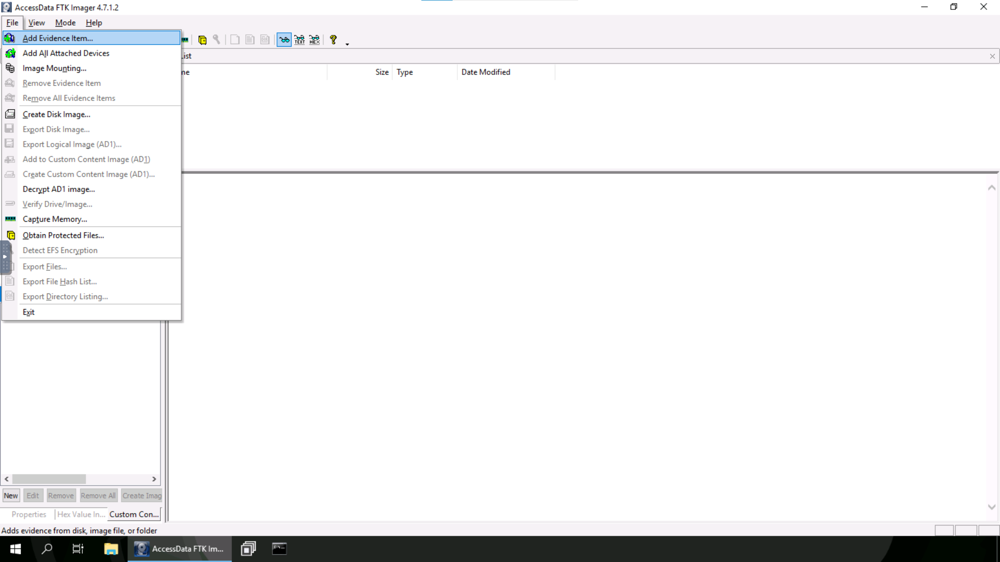

Seleccionamos `Physical Drive`.

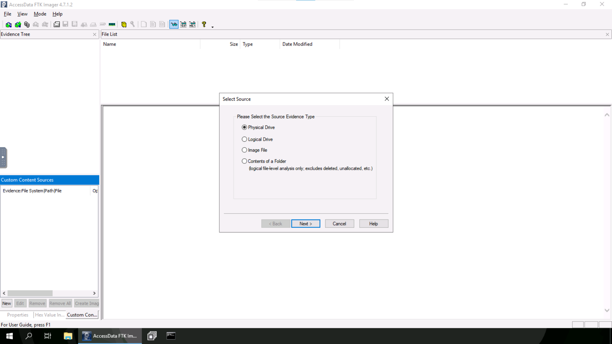

Y seleccionamos el USB emulado.

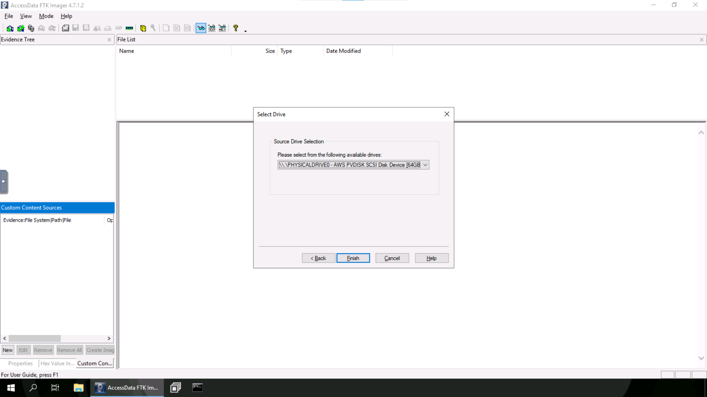

### Interfaz gráfica

La interfaz se divide en tres componentes:

1. **Estructura de la unidad de evidencia**: muestra la estructura del USB, disco o imagen en una vista jerárquica.
2. **Listado de archivos**: muestra un listado de carpetas y archivos del directorio seleccionado en el componente 1.
3. **Panel de vista**: muestra el contenido del archivo seleccionado en cualquiera de los dos componentes previos.

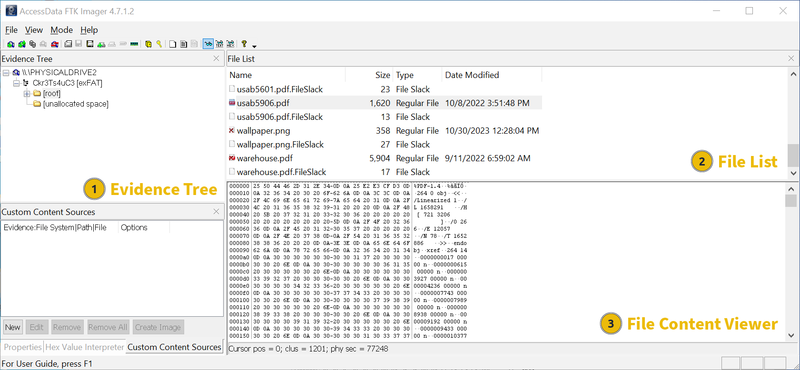

### Modos de vista

Hay tres formatos para representar el contenido que se muestra en el panel de vista:

1. **Modo automático**: selecciona el modo de visualización más óptimo para el tipo de contenido. Utiliza Internet Explorer para archivos de la web, ASCII/Unicode para texto y para tipos desconocidos utiliza su aplicación nativa en caso de que tenga, sino en HEX.
2. **Modo texto**: muestra el contenido en formato de texto ASCII o Unicode.
3. **Modo HEX**: muestra el contenido en formato hexadecimal con una más vista detallada.

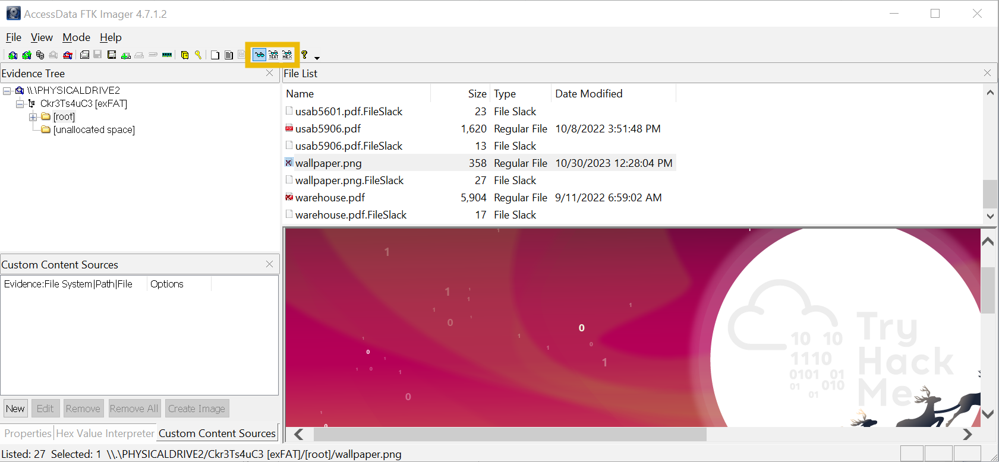

### Recuperando archivos y carpetas borradas

Los elementos borrados se visualizan en el listado de archivos con una "x". Para verlos y recuperarlos hay que seleccionarlo/s y hacer `Click der > Export Files`.

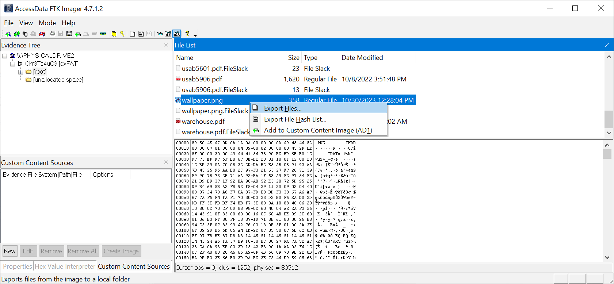

Saldrá lo siguiente:

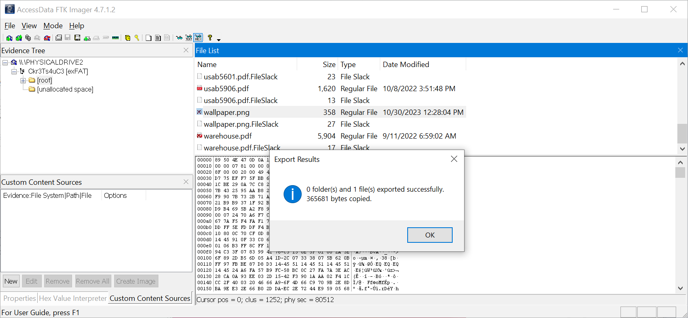

### Verificando la integridad de la unidad

Marcamos la unidad desde el panel de estructura de la evidencia y luego seleccionamos `File > Verify Drive/Image`.

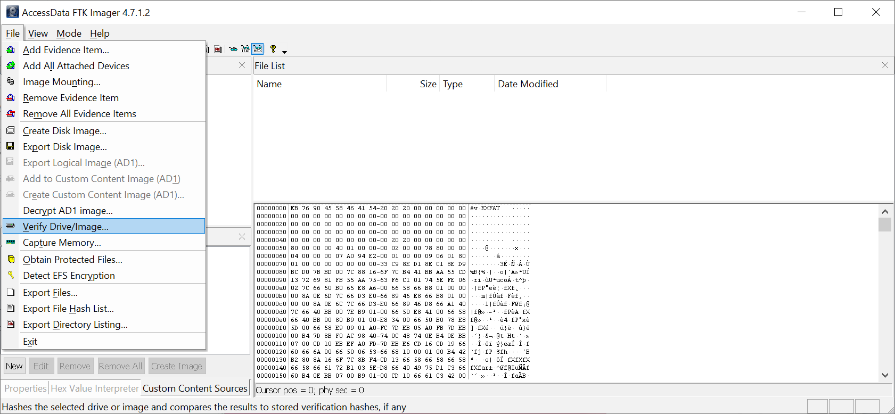

Saldrá algo así:

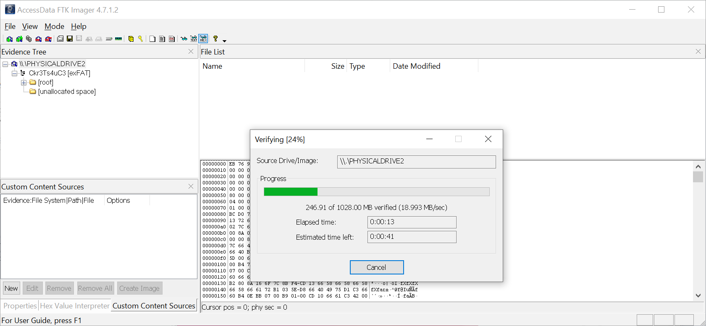

## Resolución

### Servidor C2 del malware

### Archivo dentro del zip borrado

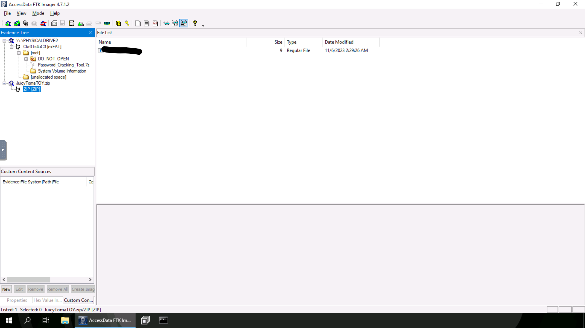

### Flag dentro de una de las imágenes borradas

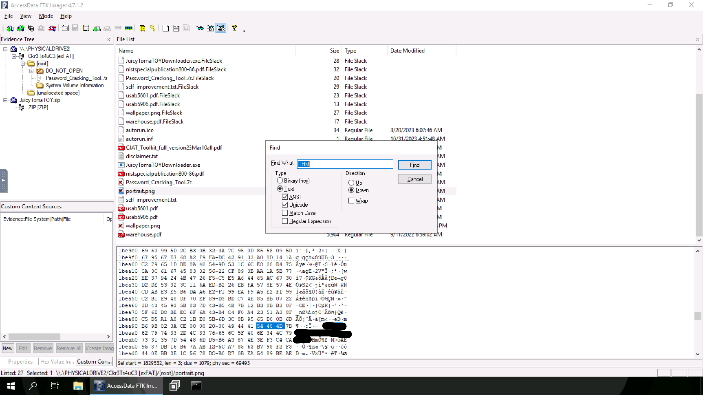

### SHA1 de la unidad

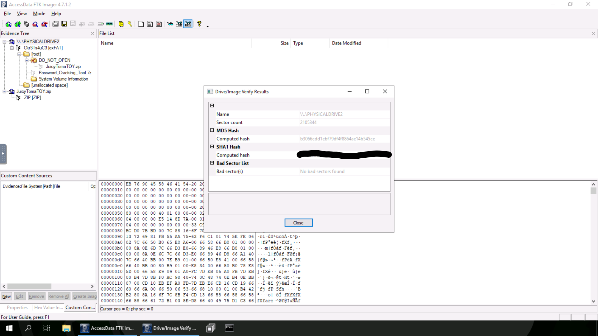

### Respuesta

Spoiler

<table>
  <thead>
    <tr>
      <th style="text-align:center">Información</th>
      <th style="text-align:center">Valor</th>
    </tr>
  </thead>
  <tbody>
    <tr>
      <td style="text-align:center">Servidor C2 del malware</td>
      <td style="text-align:center"><code>mcgreedysecretc2.thm</code></td>
    </tr>
    <tr>
      <td style="text-align:center">Archivo presente dentro del zip borrado</td>
      <td style="text-align:center"><code>JuicyTomaToy.exe</code></td>
    </tr>
    <tr>
      <td style="text-align:center">Flag</td>
      <td style="text-align:center"><code>THM{byt3-L3vel_@n4Lys15}</code></td>
    </tr>
    <tr>
      <td style="text-align:center">SHA1 de la unidad</td>
      <td style="text-align:center"><code>39f2dea6ffb43bf80d80f19d122076b3682773c2</code></td>
    </tr>
  </tbody>
</table>

### [Volver a inicio](../../README.md)
